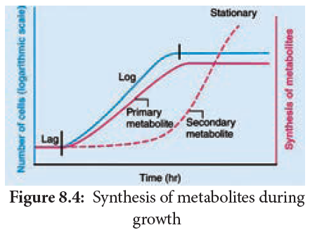

Most plants, fungi and other microbes synthesizes a number of organic compounds called as **metabolites** which are intermediates and products of metabolism. The term metabolite is usually restricted to small molecules. It can be catergorized into two types namely primary and secondary metabolites based on their role in metabolic process (Figure 8.4).

**Primary metabolites** are those that are required for the basic metabolic processes like photosynthesis, respiration, protein and lipid metabolism of living organisms.

**Secondary metabolites** does not show any direct function in growth and development of organisms.

**Morphine** is the first alkaloid to be found. It comes from the plant Opium poppy (_Papaver somniferum_).

|     Metabolites      |           Examples            |
| :------------------: | :---------------------------: |
|     **Primary**      |                               |
|       Enzymes        | protease, lipase, peroxidase  |
|        Amino         |     acid proline, leucine     |
|       Organic        | acid acetic acid, lactic acid |
|       Vitamins       |            A, B, C            |
|    **Secondary**     |                               |
|       Pigments       |   carotenoids, anthocyanins   |
|      Alkaloids       |       morphine, codeine       |
|      Essential       | oil lemon grass oil, rose oil |
|        Toxins        |         abrin, ricin          |
|       Lectins        |        concanavalin A         |
|        Drugs         |     vinblastin, curcumin      |
| Polymeric substances |    rubber, gums, cellulose    |

### Organic Molecules

Organic molecules may be small and simple. These simple molecules assemble and form large and complex molecules called **macromolecules**. These include four main classes – carbohydrates, lipids, proteins and nucleic acids. All macromolecules except lipids are formed by the process of polymerisation, a process in which repeating subunits termed monomers are bound into chains of different lengths. These chains of monomers are called **polymers**.
