---
**Learning Objectives**
The learner will be able to. 
- _Understand the ideas of cell theory_ _and the different concepts associated with it_
- _Recognize the basic structure of cell and differentiate the cells of animals, plants, bacteria and viruses_
- _Explain the structure and functions of cell organelles including nucleus_
- _Recognize the structure of chromosome and its types_

---

**Chapter Outline** 

**6.1.** Discovery 
**6.2.** Microscopy 
**6.3.** Cell theory 
**6.4.** Types of Cell 
**6.5.** Plant and Animal cell 
**6.6.** Cell organelles 
**6.7.** Nucleus 
**6.8.** Flagella

The word ‘_cell’_ comes from the Latin word ‘_Celle_” which means ‘a small compartment’. The word cell was first used by Robert Hooke (1662) therefore the term ‘_cell_’ is as old as 300 years.

**6.1. Discovery** 

**Aristotle** (384-322BC), was the one who first recognised that animals and plants consists of organised structural units but unable to explain what it was. In 1660’s **Robert Hooke** observed something which looks like ‘honeycomb with a great numbers of little boxes’ which was later called as ‘**cell**’ from the cork tissue. In 1665, He compiled his work as **Micrographia**. Later, **Anton Van Leeuwenhoek** observed unicellular particles which he named as ‘**_animalcules_**’. **Robert Brown** (1831-39) described the spherical body in plant cell as nucleus. **H. J. Dutrochet** (1824), a French scientist, was the first to give an idea on cell theory. Later, **Matthias Schleiden** (German Botanist) and **Theodor Schwann** (German Zoologist) (1833) outlined the basic features of the cell theory. **Rudolf Virchow** (1858) explained the cell theory by adding a feature stating that all living cells arise from pre-existing living cells by ‘cell division’.

**6.2. Microscopy** 

Microscope is an inevitable instrument in studying the cell and subcellular structures. It offers scope in studying microscopic organisms therefore it is named as microscope (mikros – small; skipein – to see) in Greek terminology. Compound microscope was invented by **Z. Jansen**.

Microscope basically works on the lens system and its properties of light and lens such as reflection, magnification and numerical aperture. The common light microscope which has many lenses are called as **compound microscope**. The microscope transmits visible light from sources to eye or camera through sample.

### Bright field Microscope

Bright field microscope is the routinely used microscope in studying various aspects of cells. It allows light to pass directly through specimen and shows a well distinguished image from different portions of the specimen. The contrast can be increased by staining the specimen with reagent that reacts with cells and tissue components of the object.

The light rays are focused by condenser on to the specimen on a microslide placed upon the adjustable platform called **stage**. Light comes from the Compact Flourescent Lamp (CFL) or Light Emitting Diode (LED). Then it passes through two lens systems namely objective lens (closer to the object) and the eye piece (closer to eye). There are four objective lenses (5X, 10X, 45X and 100X) which can be rotated and fixed at certain point to get required magnification. It works on the principle of numerical aperture value and its own resolving power.

The first magnification of the microscope is done by the objective lens which is called **primary magnification** and it is real, inverted image. The second  magnification of the microscope is obtained through eye piece lens called as **secondary magnification** and it is virtual and inverted image (Figure 6.2 a, b and c).

### Electron Microscope

Electron Microscope was first introduced by **Ernest Ruska** (1931) and developed by **G Binning** and **H Roher** (1981). It is used to analyse the fine details of cell and organelles called ultrastructure. It uses beam of accelerated electrons as source of illumination and therefore the resolving power is 1,00,000 times greater than that of light microscope.

The specimen to be viewed under electron microscope is dehydrated and impregnated with electron opaque chemicals like gold or palladium. This is essential for withstanding electrons and also for contrast of the image.

---
**Resolution:** The term resolving power or resolution refers to the ability of lenses to show the details of object lying between two points. It is the finest detail available from an object. It can be calculated using the following formula.

Resolution = 0.61λ / _NA_

Where, λ= wavelength of the light and NA is the numerical aperture. 

**Numerical Aperture:** It is an important optical constant associated with the optical lens denoting the ability to resolve. Higher the NA value greater will be the resolving power of the microscope. 

**Magnification:** The optical increase in size of an image is called magnification. It is calculated by the following formula Magnification = size of image seen with the microscope / size of the image seen with normal eye

---

There are two kinds of electron microscopes namely: 
1. Transmission Electron Microscope (TEM) 
2. Scanning Electron Microscope (SEM) 

**1. Transmission electron microscope:** 

This is the most commonly used electron microscope which provides two dimensional image. The components of the microscope are as follows:

a. Electron generating system 
b. Electron condensor 
c. Specimen objective 
d. Tube lens
e. Projector 

A beam of electron passes through the specimen to form an image on fluorescent screen. The magnification is 1–3 lakhs times and resolving power is 2–10 Å. It is used for studying detailed structrue of viruses,

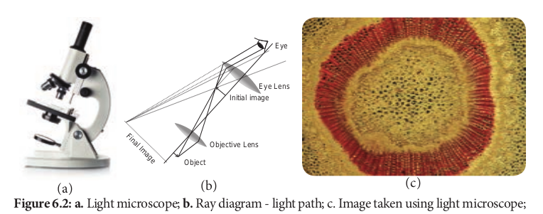

mycoplasma, cellular organelles, etc (Figure 6.3 a and b). 

**2. Scanning Electron Microscope:** 

This is used to obtain three dimensional image and has a lower resolving power than TEM. In this, electrons are focused by means of lenses into a very fine point. The interaction of electrons with the specimen results in the release of different forms of radiation (such as auger electrons, secondary electrons, back scattered electrons) from the surface of the specimen. These radiations are then captured by an appropriate detector, amplified and then imaged on fluorescent screen. The magnification is 2,00,000 times and resolution is 5–20 nm (Figure 6.4 a and b).

**6.3. Cell Theory** 

In 1833, German botanist **Matthias Schleiden** and German zoologist **Theodor Schwann** proposed that all plants and animals are composed of cells and that cells were the basic building blocks of life.

---
**Do You Know ?**
**Microscopic measurement** The microscope also has to measure microscopic through a technique ‘**micrometry**’. There are two Scales involved for measuring. 
1. Ocular Micrometre 
2. Stage Micrometre 

**Ocular Micrometre:** 

It is fixed inside the eye p It is a thin transparent glass disc where there divided into 100 equal units. The scale has no values 

**Stage Micrometre:**This is a slide with a line into 100 units. The line is about 10mm. The between two adjacent lines is 10 µm. The value of the stage micrometre is transferre measurement can be made using ocular mi The distance between two adjacent line of ocular meter = ( Number of stage divisions / Number of ocular divisions ) * 10 

---

These observations led to the formulation of modern cell theory.

- All organisms are made up of cells. 
- New cells are formed by the division of pre-existing cells. 
- Cells contains genetic material, which is passed on from parents to daughter cells. 
- All metabolic reactions take place inside the cells. 

### Exception to Cell Theory

Viruses are puzzle in biology. Viruses, viroids and prions are the exception to cell theory. They lack protoplasm, the essential part of the cell and exists as obligate parasites which are sub-cellular in nature.

### Protoplasm Theory 

**Corti** first observed protoplasm. **Felix Dujardin** (1835) observed a living juice in animal cell and called it “**Sarcode**”. **Purkinje** (1839) coined the term protoplasm for sap inside a plant cell. **Hugo Van Mohl** (1846) indicated importance of protoplasm.  

**Max Schultze** (1861) established similarity between Protoplasm and Sarcode and proposed a theory which later on called “**Protoplasm Theory**” by **O. Hertwig** (1892). **Huxley** (1868) proposed Protoplasm as a “**physical basis of life**”. 

**Protoplasm as a Colloidal System** 

Protoplasm is a complex colloidal system which was suggested by **Fisher** in 1894 and **Hardy** in 1899. It is primarily made of water and various other solutes of biological importance such as glucose, fatty acids, amino acids, minerals, vitamins, hormones and enzymes.

These solutes may be homogeneous (soluble in water) or heterogeneous mass (insoluble in water) which forms the basis for its colloidal nature.

**Physical Properties of Protoplasm** 

The protoplasm exists either in semisolid (jelly-like) state called ‘**gel**᾿ due to suspended particles and various chemical bonds or may be liquid state called ‘sol᾿.The colloidal protoplasm which is in gel form can change into sol form by **solation** and the sol can change into gel by gelation. These gel-sol conditions of colloidal system are prime basis for mechanical behaviour of cytoplasm. 

1. Protoplasm is translucent, odourless and polyphasic fluid. 
2. It is a crystal colloid solution which is a mixture of chemical substances forming crystalloid i.e. true solution (sugars, salts, acids, bases) and others forming colloidal solution (Proteins and lipids)
3. It is the most important property of the protoplasm by which it exhibits three main phenomena namely Brownian movement, amoeboid movement and cytoplasmic streaming or cyclosis. Viscosity of protoplasm is 2–20 centipoises. The Refractive index of the protoplasm is 1.4.
4. The pH of the protoplasm is around 6.8, contain 90% water (10% in dormant seeds)
5. Approximately 34 elements are present in protoplasm but only 13 elements are main or universal elements i.e. C, H, O, N, Cl, Ca, P, Na, K, S, Mg, I and Fe. Carbon, Hydrogen, Oxygen and Nitrogen form the 96% of protoplasm.
6. Protoplasm is neither a good nor a bad conductor of electricity. It forms a delimiting membrane in contact with water and solidifies when heated.
7. **Cohesiveness:** Particles or molecules of protoplasm are adhered with each other forces, such as **Van der** **Waal’s bonds**, that hold long chains of molecules together. This property varies with the strength of these forces.
8. **Contractility:** The contractility of proto- plasm is important for the absorption and removal of water especially for stomatal operations.
9. **Surface tension:** The proteins and lipids of the protoplasm have less surface tension, hence they are found at the surface forming the membrane. On the other hand the chemical substances (NaCl) have high surface tension, so they occur in deeper parts of the protoplasm.

### Cell sizes and shapes

Cell greatly vary in size, shape and also in function. Group of cells with similar structures are called **tissue** they integrate together to perform similar function, group of tissue join together to perform similar function called **organ**, group of organs with related function called **organ system**, organ system coordinating together to form an **organism**.

**Shape** The shape of cell vary greatly from organism to organism and within the organism itself. In bacteria, cell shape vary from round (**cocci**) to rectangular (**rod**). In virus, shape of the envelope varies from round to hexagonal or ‘**T**’ shaped. In fungi, globular to elongated cylindrical cells and the spores of fungi vary

---
1 cm                        = 1 / 100 meter 
1 mm = 1 / 10 cm            = 1/10 cm
1 µm = 1/1000,000 metre     = 1/10,000 cm
1 nm = 1/1,000,000,000 metre = 1/10,000,000 cm
1 Aº = 1/10,000,000,000 metre =1/100,000,000 cm

1 m = 10 ^2 cm = 10^3 mm = 10^6 µm = 10^9 nm = 10^10 Aº
m = metre   cm = centimetre   mm = millimetre   µm = micrometre
nm = nanometre   Aº =Angstrom

---
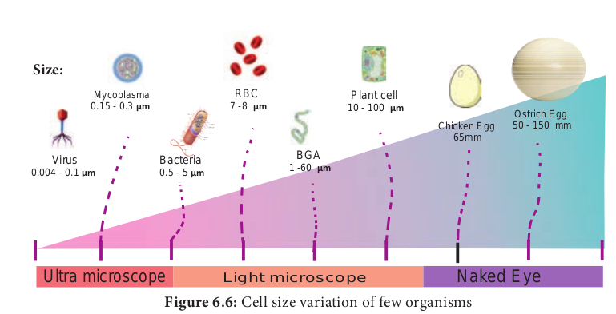
greatly in shape. In plants and animals cells vary in shape according to cell types such as parenchyma, mesophyll, palisade, tracheid, fiber, epithelium and others (Figure 6.6).

**6.4. Types of cells** 

On the basis of the cellular organization and the nuclear characteristics, the cell can be classified into
- Prokaryote. 
- Mesokaryotes an. 
- Eukaryotes

### Prokaryotes

Those organisms with primitive nucleus are called as **prokaryotes** (_pro_ – primitive; _karyon_ – nucleus). The DNA lies in the ‘nucleoid’ which is not bound by the nuclear membrane and therefore it is not a true nucleus and is also a primitive type of nuclear material. The DNA is without histone proteins. Example: Bacteria, blue green algae, Mycoplasma, Rickettsiae and Spirochaetae. 

### Mesokaryotes

In the year 1966, scientist **Dodge** and his coworkers proposed another kind of organisms called **mesokaryotes**. These organisms which shares some of the characters of both prokaryotes and eukaryotes. In other words these are organisms intermediate between pro and eukaryotes. These contains well organized nucleus with nuclear membrane and the DNA is organized into chromosomes but without histone protein components divides through amitosis similar with prokaryotes. Certain Protozoa like **Noctiluca**, some phytoplanktons like _Gymnodinium_, _Peridinium_ and Dinoflagellates are representatives of mesokaryotes.

### Eukaryotes

Those organisms which have true nucleus are called **Eukaryotes** (_Eu_ – True; _karyon_ – nucleus). The DNA is associated with histones forming the chromosomes. Membrane bound organelles are present. Few organelles may have risen by **endosymbiosis** which is a cell living inside another cell. The Organelles like mitochondria and chloroplast well support this theory.

**Origin of Eukaryotic cell:**

---
**Endosymbiont theory:** Two eukaryotic organelles believed to be the descendants of the endosymbiotic prokaryotes. The ancestors of the eukaryotic cell engulfed a bacterium and the bacteria continued to function inside the host cell.

---

|Features |Prokaryotes |Mesokaryotes |Eukaryotes |
|------|------|------|------|
| Size of the cell | ~1-5µm |~5-10µm |~10-100µm |
| Nuclear character |Nucleoid , no true nucleus,|No cleus with nuclear membrane |True nucleus with nuclear membrane |
| DNA |Usually circular without  histone proteins |Usually linear but without histone proteins |Usually line ar with histone proteins |
| RNA/Protein synthesis | Couples in cytoplasm |Similar with eukaryotes |RNA synthesis inside nucleus/ Protein synthesis in cytoplasm |
| Ribosomes |50S+ 30S |60S + 40S |60S + 40S |
| Organelles |Absent |Present |Numer ous |
| Cell  movement | Flagella |Gliding and flagella | Flagella and cilia |
| Organization |Usually single cell |Single and colony |Single , colonial and multicellular |
| Cell division | Binary fission |Binary fission | Mitosis and meiosis |
| Examples |Bacteria and Archaea |Dinoflagel late,Protozoa |Fungi, plants and animals |

**6.5. Plant and Animal cell**
**6.5.1 Ultra Structure of an Eukaryotic Cell** 

An eukaryotic cell is highly distinct in its organisation. It shows several variations in different organisms. For instance, eukaryotic cells in plants and animals vary greatly (Figure 6.7).

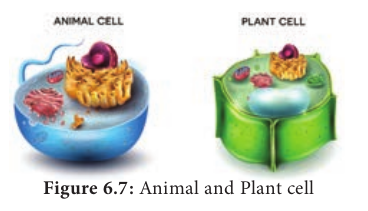

**Animal Cell** Animal cells are surrounded by cell membrane or plasma membrane. Inside this membrane a gelatinous matrix called **protoplasm** is seen to contain nucleus and other organelles which include the endoplasmic reticulum, mitochondria, golgi bodies, centrioles, lysosomes, ribosomes and cytoskeleton.

**Plant cell** 

A typical plant cell has prominent cell wall, a large central vacuole and plastids in addition to other organelles present in animal cell (Figure 6.8).

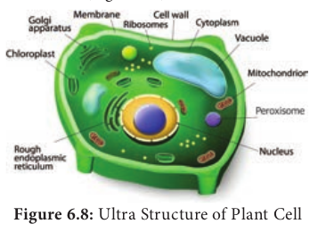

**Protoplasm**

Protoplasm is the living content of cell that is surrounded by plasma membrane. It is a colourless material that exists throughout the cell together with cytoplasm, nucleus and other organelles. Protoplasm is composed of a mixture of small particles, 

**Difference between plant and animal cell**

|**S. No** | **Plant cell**| **animal cell**|
|---|---|---|
|1 | Usually they are larger than animal cell |Usually smaller than plant cells |
|2 | Cell wall present in addition to plasma membrane and consists of mid lamellae, primary and secondary walls|Cell wall absent |
|3 |Plasmodesmata present |Plasmodesmata absent |
|4 |Chloroplast present |Chloroplast absent |
|5 |Vacuole large and permanent |Vacuole small and temporary |
|6 |Tonoplast present around vacuole|Tonoplast absent |
|7 |Centrioles absent except motile cells lower plants| Centrioles present |
|8 |Nucleus present along the periphery the cell | Nucleus at the centre of the cell |
|9 |Lysosomes are rare|Lysosomes present |
|10 |Storage material is starch grains|Storage material is a glycogen granules |

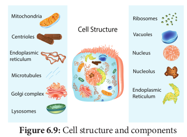
such asions, amino acids, monosaccharides, water, macromolecules like nucleic acids, proteins, lipids and polysaccharides. It appears colourless, jelly like gelatinous, viscous elastic and granular. It appears foamy due to the presence of large number of vacuoles. It responds to the stimuli like heat, electric shock, chemicals and so on.

### Cell Wall

Cell wall is the outermost protective cover of the cell. It is present in bacteria, fungi and plants whereas it is absent in animal cell. It was first observed by **Robert Hooke**. It is an actively growing portion. It is made up of different complex material in various organism. In bacteria it is composed of peptidoglycan, in fungi chitin and fungal cellulose, in algae cellulose, galactans and mannans. In plants it is made up of cellulose, hemicellulose, pectin, lignin, cutin, suberin and silica.

In plant, cell wall shows three distinct regions (a) Primary wall (b) Secondary wall (c) Middle lamellae (Figure 6.10).

**a. Primary wall** It is the first layer inner to middle lamella, primarily consisting of loose network of cellulose microfibrils in a gel matrix. It is thin, elastic and extensible.In most plants the microfibrils are made up of cellulose oriented differently based on shape and thickness of the wall. The matrix of the primary wall is composed of hemicellulose, pectin, glycoprotein and water. Hemicellulose binds the microfibrils with matrix and glycoproteins control the orientation of microfibrils while pectin serves as filling material of the matrix. Cells such as parenchyma and meristems have only primary wall.  

**b. Secondary wall** Secondary wall is laid during maturation of the cell. It plays a key role in determining the shape of a cell. It is thick, inelastic and is made up of cellulose and lignin. The secondary wall is divided into three sublayers termed as S1, S2 and S3 where the cellulose microfibrils are compactly arranged with different orientation forming a laminated structure and the cell wall strength is increased.

**c. Middle lamellae** It is the outermost layer made up of calcium and magnesium pectate, deposited at the time of cytokinesis. It is a thin amorphous layer which cements two adjacent cells. It is optically inactive (isotropic).

**Plasmodesmata and Pits** 
Plasmodesmata act as a channel between the protoplasm of adjacent cells through which many substances pass through. Moreover, at few regions, the secondary wall layer is laid unevenly whereas the primary wall and middle lamellae are laid continuously such regions are called pits. The Pits of adjacent cells are opposite to each other. Each pit has a pit chamber and a pit membrane. The pit membrane has many minute pores and thus they are permeable. The pits are of two types namely simple and bordered pit.
 
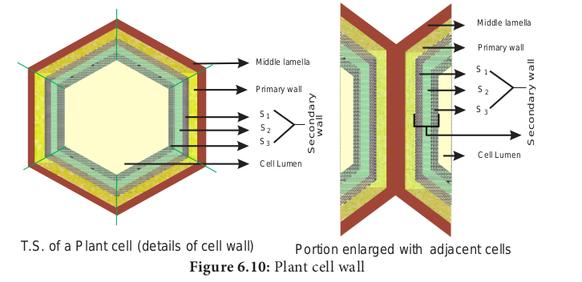

**Functions of cell wall** 

The cell wall plays a vital role in holding several important functions given below 

1. Offers definite shape and rigidity to the cell. 
2. Serves as barrier for several molecules to enter the cells. 
3. Provides protection to the internal protoplasm against mechanical injury. 
4. Prevents the bursting of cells by maintaining the osmotic pressure. 
5. Plays a major role by acting as a mechanism of defense for the cells.

### Cell Membrane

The cell membrane is also called **cell surface** (or) **plasma membrane**. It is a thin structure which holds the cytoplasmic content called ‘**cytosol**’. It is extremely thin (less than 10nm).

**Fluid Mosaic Model** 
**Jonathan Singer** and **Garth Nicolson** (1972) proposed fluid mosaic model.

It is made up of lipids and proteins together with a little amount of carbohydrate. The lipid membrane is made up of phospholipid. The phospholipid molecule has a hydrophobic tail and hydrophilic head. The hydrophobic tail repels water and hydrophilic head attracts water. The proteins of the membrane are globular proteins which are found intermingled between the lipid bilayer most of which are projecting beyond the lipid bilayer. These proteins are called as **integral proteins**. Few are superficially attached on either surface of the lipid bilayer which are called as **peripheral proteins**. The proteins are involved in transport of molecules across the membranes and also act as enzymes, receptors (or) antigens.

---

Water-loving polar molecule are called hydrophilic molecule. They have polar phosphate group responsible for attracting water.

Water hating non-polar molecule are called as hydrophobic molecule. They have fatty acid which is non-polar which cannot attract water

---
Carbohydrate molecules of cell membrane are short chain polysaccharides. These are either bound with ‘**glycoproteins**’ or ‘**glycolipids**’ and form a ‘**glyocalyx’** (Figure 6.11). 

The movement of membrane lipids from one side of the membrane to the other side by vertical movement is called flip flopping or **flip flop movement. This movement takes** place more slowly than lateral diffusion of lipid molecule. The Phospholipids can have flip flop movement because they have smaller polar regions, whereas the proteins cannot flip flop because the polar region is extensive.  

**Function of Cell Membrane** 

The functions of the cell membrane is enormous which includes cell signalling, transporting nutrients and water, preventing unwanted substances entering into the cell, and so on.

**Cytoplasm** 

Cytoplasm is the main arena of various activities of a cell. It is the semifluid gelatinous substance that fills the cell. It is made up of eighty percent water and is usually clear and colourless. The cytoplasm is sometimes described as non nuclear content of protoplasm. The cytoplasm serves as a molecular soup where all the cellular organelles are suspended and bound together by a lipid bilayer plasma membrane. It constitutes dissolved nutrients, numerous salts and acids to dissolve waste products. It is a very good conductor of electricity. It gives support and protection to the cell organelles. It helps movement of the cellular materials around the cell through a process called **cytoplasmic streaming**. Further, most cellular activities such as many metabolic pathways including glycolysis and cell division occur in cytoplasm.

## Cell Organelles 

**Endomembrane System**

System of membranes in a eukaryotic cell, comprises the plasma membrane, nuclear membrane, endoplasmic reticulum, golgi apparatus, lysosomes and vacuolar membranes (tonoplast). Endomembranes are made up of phospholipids with embedded proteins that are similar to cell membrane which occur within the cytoplasm. The endomembrane system is evolved from the inward growth of cell membrane in the ancestors of the first eukaryotes (Figure 6.12).

### Endoplasmic Reticulum

The largest of the internal membranes is called the **endoplasmic reticulum** (ER). The name endoplasmic reticulum was given by **K.R. Porter** (1948). It consists of double membrane. Morphologically the structure of endoplasmic reticulum consists of the following:

**1.Cisternae** are long, broad, flat, sac like structures arranged in parallel bundles or stacks to form lamella. The space between membranes of cisternae is filled with fluid.

**2.Vesicles** are oval membrane bound vacuolar structure.

**3.Tubules** are irregular in shape, branched, smooth walled, enclose a space

Endoplasmic reticulum is associated with nuclear membrane and cell surface membrane. It forms a network in cytoplasm and gives mechanical support to the cell. Its chemical environment enables protein folding and undergo modification necessary for their function. Misfolded proteins are pulled out and are degraded in endoplasmic reticulum. When ribosomes are present in the outer surface of the membrane it is called as **rough endoplasmic reticulum(RER)**, when the ribosomes are absent in the endoplasmic reticulum it is called as **smooth Endoplasmic reticulum(SER)**. Rough endoplasmic reticulum is involved in protein synthesis and smooth endoplasmic reticulum are the sites of lipid synthesis. The smooth endoplasmic reticulum contains enzymes that detoxify lipid soluble drugs, certain chemicals and other harmful compounds.

### Golgi Body (Dictyosomes)

In 1898, **Camillo Golgi** visualized a netlike reticulum of fibrils near the nucleus, were named as **Golgi bodies.** In plant cells they are found as smaller vesicles termed as **dictyosomes**. Golgi apparatus is a stack of flat membrane enclosed sacs. It consist of cisternae, tubules, vesicles and golgi vacuoles. In plants, the cisternae are 10-20 in number placed in piles separated from each other by a thin layer of inter cisternal cytoplasm often flat or curved. Peripheral edge of cisternae forms a network of tubules and vesicles.

Tubules interconnect cisternae and are 30-50nm in dimension. Vesicles are large round or concave sac. They are pinched off from the tubules.They are smooth/ secretary or coated type. Golgi vacuoles are large spherical structures filled with granular or amorphous substance, some function like lysosomes. Golgi apparatus compartmentalises a series of steps leading to the production of functional protein.

Small pieces of rough endoplasmic reticulum are pinched off at the ends to form small vesicles. A number of these vesicles then join up and fuse together to make a Golgi body. Golgi complex plays a major role in post translational modification of proteins and glycosylation of lipids (Figure 6.13 and 6.14).

**Functions:** 
- Production of glycoproteins and glycolipid. 
- Transporting and storing of lipids. 
- Formation of lysosomes. 
- Production of digestive enzymes. 
- Cell plate and cell wall formation
- Secretion of carbohydrates for the formation of plant cell walls and insect cuticles.
- **Zymogen granules** (proenzyme/precursor of all enzyme) are synthesised.

### Mitochondria

It was first observed by **A. Kolliker** (1880). **Altmann** (1894) named it as Bioplasts. Later **Benda** (1897, 1898), named as mitochondria. They are ovoid, rounded, rod shape and pleomorphic structures. Mitochondrion consists of double membrane, the outer and inner membrane. The outer membrane is smooth, highly permeable to small molecules and it contains proteins called **Porins**, which form channels that allows free diffusion of molecules smaller than about 1000 daltons and the inner membrane divides mitochondrion into two compartments, outer chamber between two membranes and the inner chamber is filled with matrix.

The inner membrane is convoluted (infoldings), called **crista** (plural: cristae). Cristae contain most of the enzymes for electron transport system. Inner chamber of the mitochondrion is filled with proteinaceous material called **mitochondrial matrix**. The Inner membrane consists of stalked particles called **elementary particles** or **Fernandez Moran particles**, **F1 particles** or **Oxysomes.** Each particle consists of a base, stem and a round head. In the head, ATP synthase is present for oxidative phosphorylation. Inner membrane is impermeable to most ions, small molecules and maintains the proton gradient that drives oxidative phosphorylation (Figure 6.15).

Mitochondria contain 73% of proteins, 25-30% of lipids, 5-7 % of RNA, DNA (in traces) and enzymes (about 60 types). Mitochondria are called **Power house of a cell**, as they produce energy rich ATP.

All the enzymes of Kreb’s cycle are found in the matrix except succinate dehydrogenase. Mitochondria consist of circular DNA and 70S ribosome. They multiply by fission and replicates by strand displacement model. Because of the presence of DNAs it is semi- autonomous organelle. Unique characteristic of mitochondria is that they are inherited from female parent only. Mitochondrial DNA comparisons are used to trace human origins. It is also used to track and date recent evolutionary time because it mutates 5 to 10 time faster than DNA in the nucleus.

### Plastids

The term plastid is derived from the Greek word **_Platikas_** (formed/moulded) and used by **A.F.U. Schimper** in 1885. He classified plastids into following types according to their structure, pigments and function. Plastids multiply by fission.

**Plastids** 
|**Chromoplasts**|**Leucoplasts**|
|---|---|
|Coloured Plastids|Colourless plastids store food materials|  
|**Chloroplast** Occurs in green algae and higher plants. Pigments chlorophyll _a_ and _b_|**Amyloplast** – stores – starch|
|**Phaeoplast** Brown algae and dinoflagellates. Pigment- fucoxanthin|**Elaioplast** – store – lipids (oils). Seed of monocot and dicots.|
|**Rhodoplast** Red algae Pigment- Phycoerythrin|**Aleuroplast** (or) **Proteoplast** Stores – Protein|

According to Schimper, different kind of plastids can transform into one another.

### Chloroplast

Chloroplasts are vital organelle found in green plants. Chloroplast has a double membrane the outer membrane and the inner membrane separated by a space called **periplastidial space**. The space enclosed by the inner membrane of chloroplast is filled with gelatinous matrix, lipo-proteinaceous fluid called **stroma**. Inside the stroma there are flat interconnected sacs called **thylakoid**. The membrane of thylakoid enclose a space called **thylakoid lumen**.  

**Grana** (singular: Granum) are formed when many of these thylakoids are stacked together like pile of coins. Light is absorbed and converted into chemical energy in the granum, which is used in stroma to prepare carbohydrates. Thylakoid contain chlorophyll pigments. The chloroplast contains osmophilic granules, 70s ribosomes, DNA (circular and non histone) and RNA. These chloroplast genome encodes approximately 30 proteins involved in photosynthesis including the components of photosystem I & II, cytochrome bf complex and ATP synthase. One of the subunits of RuBisco is encoded by chloroplast DNA. It is the major protein component of chloroplast stroma, single most abundant protein on earth. The thylakoid contain small, rounded photosynthetic units called **quantosomes**. Chloroplast is a semi-autonomous organelle and divides by fission (Figure 6.16).

**Functions:** 
- Photosynthesi. 
- Light reactions takes place in granum. 
- Dark reactions take place in stroma. 
- Chloroplast is involved in photo-respiration.

### Ribosome

Ribosomes were first observed by **George Palade** (1953) as dense particles or granules in the electron microscope. Electron microscopic observation reveals that ribosomes are composed of two rounded sub units, united together to form a complete unit. Mg2+ is required for structural cohesion of ribosomes. Biogenesis of ribosome is a _de nova_ formation, auto replication and nucleolar origin. Each ribosome is made up of one small and one large sub-unit Ribosomes are the sites of protein synthesis in the cell. Ribosome is not a membrane bound organelle (Figure 6.17).

---
**Do You Know ?**
**Svedberg unit (s).** The size of ribosomes and their subunits are usually given in Svedberg unit (named after Theoder Svedberg, Swedish Chemist Noble Laureate 1929), a measure of a particle size dependent on the speed with which particle sediment in the ultracentrifuge.

---
Ribosome consists of RNA and protein: RNA 60 % and protein 40%. During protein synthesis, many ribosomes are attached to the single mRNA and is called **polysomes** or **polyribosomes**. The function of polysomes is the formation of several copies of a particular polypeptide during protein synthesis. They are free in non-protein synthesising cells. In protein synthesising cells they are linked together with the help of Mg ^2+ ions.

**Types of Ribosomes**
|70S Ribosomes (sub unit 30S and 50S)|80S Ribosomes (sub units 40S and 60S)|
|---|---|
|3 RNA molecule (i) 16SrRNA in 30S subunit (ii) 23S and 5S in 50S large subunit **(Prokaryotic cells of bluegreen , algae bacteria, mitochondria and chloroplast of many algae and higher plants)**|4 RNA molecule (i) 18SrRNA in 40S small subunit (ii) 28S, 5.8S and 5S in larger 60S subunit **(Eukaryotic cells of plants and animals)**|

### Lysosomes (Suicidal Bags of Cell)

Lysosomes were discovered by **Christian de Duve** (1953), these are known as **suicidal bags**. They are spherical bodies enclosed by a single unit membrane. They are found in eukaryotic cell. Lysosomes are small vacuoles formed when small pieces of golgi body are pinched off from its tubules.

They contain a variety of hydrolytic enzymes, that can digest material within the cell. The membrane around lysosome prevent these enzymes from digesting the cell itself (Figure 6.18).

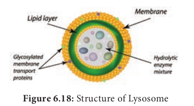

**Functions :**

- **Intracellular digestion:** They digest carbohydrates, proteins and lipids present in cytoplasm.

- **Autophagy:** During adverse condition they digest their own cell organelles like mitochondria and endoplasmic reticulum

- **Autolysis:** Lysosome causes self destruction of cell.

- **Ageing:** Lysosomes have autolytic enzymes that disrupts intracellular molecules.

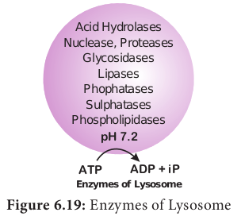
- **Phagocytosis:** Large cells or contents are engulfed and digested by macrophages, thus forming a phagosome in cytoplasm. These phagosome fuse with lysosome for further digestion.

- **Exocytosis:** Lysosomes release their enzymes outside the cell to digest other cells (Figure 6.19).  

### Microbodies
 Eukaryotic cells contain many enzyme bearing membrane enclosed vesicles called **microbodies**. They are single unit membrane bound cell organelles. Example: Peroxisomes and glyoxysomes.

### Peroxisomes

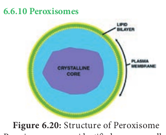

**Structure of Peroxisome** Peroxisomes were identified as organelles by **Christian de Duve** (1967). Peroxisomes are small spherical bodies and single membrane bound organelle. It takes part in photorespiration and associated with glycolate metabolism. In plants, leaf cells have many peroxisomes. It is also commonly found in liver and kidney of mammals. These are also found in cells of protozoa and yeast (Figure 6.20). 

### Glyoxysomes

Glyoxysome was discovered by **Harry Beevers** (1961). It is a single membrane bound organelle. It is a sub cellular organelle and contains enzymes of glyoxylate pathway. β-oxidation of fatty acid occurs in glyoxysomes of germinating seeds Example: Castor seeds. 

### Sphaerosomes

It is spherical in shape and enclosed by single unit membrane. Example: Storage of fat in the endosperm cells of oil seeds. 

### Centrioles

Centrioles consists of nine triplet peripheral fibrils made up of tubulin. The central part of the centriole is called **hub**, is connected to the tubules of the peripheral triplets by radial spokes (9+0 pattern). The centriole form the basal body of cilia or flagella and spindle fibers which forms the spindle apparatus in animal cells. The membrane is absent in centriole (non-membranous organelle) (Figure 6.21).

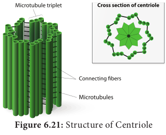

### Vacuoles

In plant cells vacuoles are large, bounded by a single unit membrane called **Tonoplast**. The Vacuoles contain cell sap, which is a solution of sugars, amino acids, mineral salts, waste chemical and anthocyanin pigments. Beetroot cells contain anthocyanin pigments in their vacuoles. Vacuoles accumulate products like tannins. The osmotic expansion of a cell kept in water is chiefly regulated by vacuole and the water enters the vacuole by osmosis.

The major function of plant vacuole is to maintain water pressure known as **turgor pressure**, which maintains the plant structure. Vacuoles organises itself into a storage/ sequestration compartment. Example: Vacuoles store, most of the sucrose of the cell.

i. Sugar in Sugar beet and Sugar cane. ii. Malic acid in Apple.
iii. Acids in Citrus fruits. 
iv. Flavonoid pigment cyanidin 3 rutinoside in the petals of _Antirrhinum_. 

**Nucleus** 

Nucleus is an important unit of cell which controls all activities of the cell. Nucleus holds the hereditary information. It is the largest among all cell organelles. It may be spherical, cuboidal, ellipsoidal or discoidal.

It is surrounded by a double membrane structure called **nuclear envelope**, which has the inner and outer membrane. The inner membrane is smooth without ribosomes and the outer membrane is rough by the presence of ribosomes and it continues with irregular and infrequent intervals with the endoplasmic reticulum. The membrane is perforated by pores known as **nuclear pores** which allows materials such as mRNA, ribosomal units, proteins and other macromolecules to pass in and out of the nucleus. The pores enclosed by circular structures called **annuli**. The pore and annuli form the **pore complex**. The space between two membranes is called **perinuclear space**.

---
**Do You Know ?**
**Chromatin** is a viscous gelatinous substance that contains DNA, histone & non–histone proteins and RNA. H1, H2A, H2B, H3 and H4 are the different histones found in chromatin. It is formed by a series of repeated units called nucleosomes. Each nucleosome has a core of eight histone subunits.

---
Nuclear space is filled with **nucleoplasm**, a gelatinous matrix has uncondensed **chromatin** network and a conspicuous **nucleolius**. The Chromatin network is an uncoiled, indistinct and remain thread like during the interphase. It has little amount of RNA and DNA bound to histone proteins in eukaryotic cells (Figure 6.22).

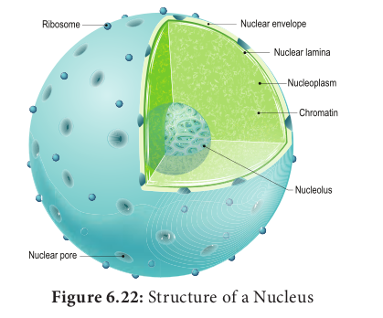
During cell division chromatin is condensed into an organized form called **chromosome**. The portion an eukaryotic chromosome which is transcribed into mRNA contains active genes that are nottightly condensed during interphase is called **Euchromatin**. The portion of an eukaryotic chromosome that is not transcribed into mRNA which remains condensed during interphase and stains intensely is called **Heterochromatin. Nucleolus** is a small, dense, spherical structure either present singly or in multiples inside the nucleus and it’s not membrane bound. Nucleoli possess genes for rRNA and tRNA. 

**Functions of the nucleus** 

- Controlling all cellular activitie. 
- Storing the genetic or hereditary information. 
- Coding the information from DNA for the production of enzymes and proteins. 
- DNA duplication and transcription takes place in the nucleus. 
- In nucleolus ribosomal biogenesis takes place.

### Chromosomes 

**Strasburger** (1875) first reported its present in eukaryotic cell and the term ‘chromosome’ was introduced by **Waldeyer** in 1888. **Bridges** (1916) first proved that chromosomes are the physical carriers of genes. It is made up of DNA and associated proteins. 

**Structure of chromosome** 

The chromosomes are composed of thread like strands called **chromatin** which is made up of DNA, protein and RNA. Each chromosome consists of two symmetrical structures called **chromatids**. During cell division the chromatids forms a well organized chromosomes with definite size and shape. They are identical and are called **sister chromatids**. A typical chromosome has narrow zones called **constrictions**. There are two types of constrictions, namely primary constriction and secondary constriction. The **primary constriction** is made up of **centromere** and kinetochore. Both the chromatids are united at centromere, whose number varies. The **monocentric** chromosome has one centromere and the **polycentric** chromosome has many centromeres. Centromere contains a complex system of protein fibres called **kinetochore**. Kinetochore is the region of chromosome which is attached to the spindle fibre during mitosis.

Besides primary there are few **secondary constrictions,** are present. Nucleoli develop from these secondary constrictions are called **nucleolar organizers**. Secondary constrictions contain the genes for ribosomal RNA which induce the formation of nucleoli and are called **nucleolar organizer regions** (Figure 6.23).

A **satellite** or SAT Chromosome is a short chromosomal segment or rounded
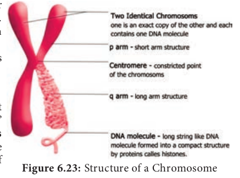
body separated from main chromosome by a relatively elongated secondary constriction. It is a morphological entity in certain chromosomes.

**Telomere** is the terminal part of chromosome. It offers stability to the chromosome. DNA of the telomere has specific sequence of nucleotides. Telomere in all eukaryotes are composed of many repeats of short DNA sequences (**5’TTAGGG3’** sequence in _Neurospora crassa_ and human beings). Maintenance of telomeres appears to be an important factor in determining the life span and reproductive capacity of cells, so studies of telomeres and telomerase have the promise of providing new insights into conditions such as ageing and cancer. Telomeres prevent the fusion of chromosomal ends with one another.

---
**Chromonema fibre**: A chromatin fibre, 100 – 130 nm in diameter, an element of higher order packing within the chromosome. During prophase the chromosomal material becomes visible as very thin filament called chromonemata, which is called as chromatids in early stages of condensation. Chromatid and chromonema are the two names for the same structure a single linear DNA molecule with its associated proteins

**Chromomeres**: Chromomeres are bead like accumulations of chromatin material which are visible along interphase chromosomes. They can be seen in polytene chromosomes. At metaphase they are not visible.

---
**Types of Chromosomes**

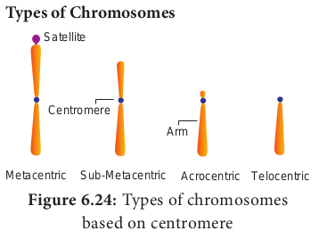

Based on the position of centromere, chromosomes are called **telocentric** (terminal centromere), **acrocentric** (terminal centromere capped by telomere), **sub metacentric** (centromere subterminal) and **metacentric** (centromere median). The eukaryotic chromosome may be rod shaped (telocentric and acrocentric), L-shaped (sub-metacentric) and V-shaped (metacentric) (Figure 6.24).

Based on the functions of chromosome it can be divided into **autosomes** and **sex**  

**chromosomes**. 

Autosomes are present in all cells controlling somatic characteristics of an organism. In human diploid cell, 44 chromosomes are autosomes whereas two are sex chromosomes. Sex chromosomes are involved in the determination of sex. 

**Special types of chromosomes**

These chromosomes are larger in size and are called **giant chromosomes** in certain plants and they are found in the suspensors of the embryo. The polytene chromosome and lamp brush chromosome occur in animals and are also called as **giant chromosomes.**

**Polytene chromosomes** observed in the salivary glands of Drosophila (fruit fly) by **E.G. Balbiani** in 1881. In larvae of many flies, midges (_Dipthera_) and some insects the interphase chromosomes duplicates and reduplicates without nuclear division. A single chromosome which is present in multiple copies form a structure called **polytene chromosome** which can be seen in light microscope. They are genetically active. There is a distinct alternating dark bands and light inter-bands. About 95% of DNA are present in bands and 5% in inter-bands. The polytene chromosome has extremely large puff called **Balbiani rings** which is seen in Chironomous larvae. It is also known as **chromosomal puff**. Puffing of bands are the sites of intense RNA synthesis. As this chromosome occurs in the salivary gland it is known as **salivary gland chromosomes**. Gene expression, transcription of genes and RNA synthesis occurs in the bands along the polytene chromosomes.

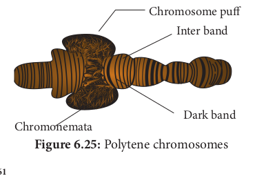

**Lampbrush chromosomes** occur at the diplotene stage of first meiotic prophase in oocytes of an animal **Salamandar** and in giant nucleus of the unicellular alga _Acetabularia_. It was first observed by **Flemming** in 1882. The highly condensed chromosome forms the chromosomal axis, from which lateral loops of DNA extend as a result of intense RNA synthesis.
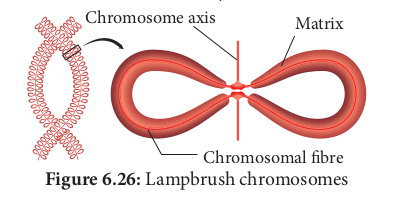

**6.8. Flagella** 

**6.8.1 Prokaryotic Flagellum** 
Bacterial flagella are helical appendages helps in motility. They are much thinner than flagella or cilia of eukaryotes. The filament contains a protein called **flagellin**. The structure consists of a basal body associated with cytoplasmic membrane and cell wall with short hook and helical filament. Bacteria rotates their helical flagella and propels rings present in the basal body which are involved in the rotary motor that spins the flagellum.

---
**Check your grasp ?** When E.coli are cultured in medium rich in glucose they lack flagella. When grown in nutritionally poor medium they possess flagella. What does this indicate about the value of flagella?

Flagella is essential to seek out a nutritionally more favourable environment.

---
**Structure of flagella in Bacteria** The gram positive bacteria contain only two basal rings. S-ring is attached to the inside of peptidoglycan and M-ring is attached to the cell membrane. In Gram negative bacteria two pairs of rings proximal and distal ring are connected by a central rod. They are L-Lipopolysaccharide ring, P-Peptidoglycan ring, S-Super membrane ring and M-membrane ring. The outer pair L and P rings is attached to cell wall and the inner pair S and M rings attached to cell membrane (Figure 6.27).

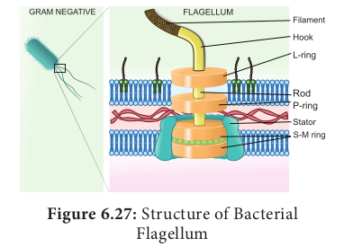

**Mechanism of flagellar movement – proton motive force** 

In flagellar rotation only proton movements are involved and not ATP. Protons flowing back into the cell through the basal body rings of each flagellum drives it to rotate. These rings constitute the rotary motor.The proton motive force (The force derived from the electrical potential and the hydrogen ion gradient across the cytoplasmic membrane) drives the flagellar motor. For the rotation of flagellum the energy is derived from proton gradient across the plasma membrane generated by oxidative phosphorylation. In bacteria flagellar motor is located in the plasma membrane where the oxidative phosphorylation takes place.Therefore, plasma membrane is a site of generation of proton motive force.

### Eukaryotic Flagellum– Cell Motility 
**Structure** 
**Eukaryotic Flagella** are enclosed by unit membrane and it arises from a basal body. Flagella is composed of outer nine pairs of microtubules with two microtubules in its centre (9+2 arrangement). Flagella are microtubule projection of the plasma membrane. Flagellum is longer than cilium (as long as 200µm). The structure of flagellum has an axoneme made up microtubules and protein tubulin (Figure 6.28).

**Movement** 

Outer microtubule doublet is associated with axonemal dynein which generates force for movement. The movement is ATP driven. The interaction between tubulin and dynein is the mechanism for the contraction of cilia and flagella. Dynein molecules uses energy from ATP to shift the adjacent microtubules. This movement bends the cilium or flagellum. 

### Cilia

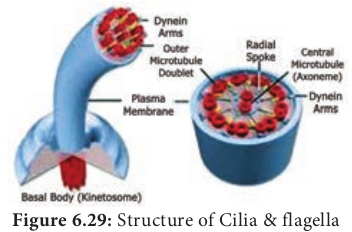

Cilia (plural) are short cellular, numerous microtubule bound projections of plasma membrane. Cilium (singular) is membrane bound structure made up of basal body, rootlets, basal plate and shaft. The shaft or **axoneme** consists of nine pairs of microtubule doublets, arranged in a circle along the periphery with a two central tubules, (**9+2**) arrangement of microtubules is present. Microtubules are made up of tubulin. The motor protein **dynein** connects the outer microtubule pair and links them to the central pair. Nexin links the peripheral doublets of microtubules (Figure 6.29).

**Summary** Cell is the fundamental unit of all organisms which was identified 300 years ago. Microscope offers scope for observing smaller objects and organisms. It works on the principle of light and lenses. Different microscope offers clarity in observing objects depending on the features to be observed. Micrometric techniques are used in measurement of microscopic objects. Electron microscopes are used in understanding the ultra-structural details of cell. Cell theory and doctrine states that all organism are made up of cell and it contains genetic material. Protoplasm theory explains nature and different properties of protoplasm. Cell size and shape differ from type of tissue or organs and organisms. Based on cellular organization and nuclear characters the organisms are classified into prokaryote, eukaryote and mesokaryote.

Key difference between plant cell and animal cell is the cell wall. Protoplasm is the colourless mass includes the cytoplasm, cell organelles and nucleus. Cell wall is the outermost protective covering with three regions primary, secondary wall and middle lamellae. Cell membrane holds the cytoplasmic content called **cytosol**. Cytoplasm includes the matrix and the cell organelles excluding nucleus. Endomembrane system includes endoplasmic reticulum, golgi apparatus, chloroplast, lysosomes, vacuoles, nuclear membrane and plasma membrane. Nucleus is the control unit of the cell, it carries hereditary information. Chromosomes are made up of DNA and associated proteins. Bacterial flagella are made up of helical polymers of a protein called **flagellin**. Proton motive force are involved in flagellar rotation. In Eukaryotes

**Concept Map Cell**
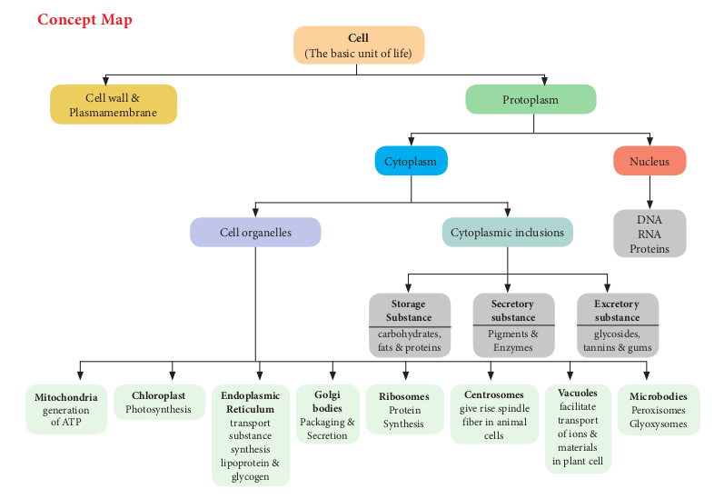