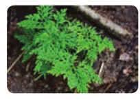
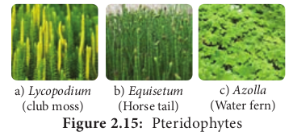
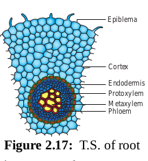
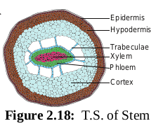
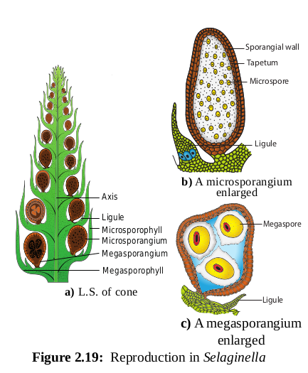

## Pteridophytes

**Seedless Vascular Cryptogams**
From the previous section, we are aware of the salient features of amphibious plants called bryophytes. But there is a plant group called pteridophytes which are considered as first true land plants. Further, they were the first plants to acquire vascular tissue namely xylem and phloem, hence called vascular cryptogams. Club moss, horsetails, quill worts, water ferns and tree ferns belong to this group. This chapter deals with the characteristic features of Pteridophytes.

Pteridophytes are the vascular cryptogams and were abundant in the Devonian period of Palaeozoic era (400 million years ago). These plants are mostly small, herbaceous and grow well in moist, cool and shady places where water is available. The photographs for some pteridophytes are given in Figure 2.15.


**Pteridophytes:**

- Plant body is sporophyte (2n) and it is the dominant phase. It is differentiated into root, stem and leaves.
- Roots are adventitious.
- Stem shows monopodial or dichotomous branching.
- Leaves may be microphyllous or megaphyllous.
- Stele is protostele but in some forms siphonostele is present (_Marsilea_.)
- Tracheids are the major water conducting elements but in _Selaginella_ vessels are found.
- Sporangia, spore bearing bag like structures are borne on special leaves called sporophyll. The Sporophylls get organized to form cone or strobilus. Example: _Selaginella_, _Equisetum_ .
- They may be **homosporous (**produce one type of spores-_Lycopodium_) or **Heterosporous (**produce two types of spores**\-**_Selaginella)_. Heterospory is the origin for seed habit.
- Development of sporangia may be **eusporangiate** (development of sporangium from group of initials) or **leptosporangiate** (development of sporangium from single initial).
- Spore mother cells undergo meiosis and produce spores (n).
- Spore germinates to produce haploid, multicellular green, cordate shaped independent gametophytes called prothallus.
- Fragmentation, resting buds, root tubers and adventitious buds help in vegetative reproduction.
- Sexual reproduction is oogamous. Sex organs, namely antheridium and archegonium are produced on the prothallus.
- Antheridium produces spirally coiled and multiflagellate antherozoids.
- Archegonium is flask shaped with broad venter and elongated narrow neck. The venter possesses egg or ovum and neck contain neck canal cells.
- Water is essential for fertilization. After fertilization a diploid zygote is formed and undergoes mitotic division to form embryo.
- Pteridophytes show **apogamy** and **apospory.**

## Classification of Pteridophytes

Reimer (1954) proposed a classification for pteridophytes. In this classification, the pteridophytes are divided into five subdivisions. 1. Psilophytopsida 2. Psilotopsida 3. Lycopsida 4. Sphenopsida 5. Pteropsida. There are 19 orders and 48 families in the classification.

## Economic Importance

The Economic importance of Pteridophyte is given in Table 2.4

**Table 2.4: Economic importance of Pteridophyte**

| \*\*Pteridophyte                                           | Uses\*\*                                            |
| ---------------------------------------------------------- | --------------------------------------------------- |
| _Rumohra adiantiformis_ (leather leaf fern)                | Cut flower arrangements.                            |
| _Marsilea_                                                 | Food                                                |
| _Azolla_                                                   | Biofertilizer.                                      |
| _Dryopteris filix–mas_                                     | Treatment for tapeworm.                             |
| _Pteris vittata_                                           | Removal of heavy metals from soils - Bioremediation |
| _Pteridium_ sp.                                            | Leaves yield green dye.                             |
| _Equisetum_ sp.                                            | Stems for scouring.                                 |
| _Psilotum, Lycopodium, Selaginella, Angiopteris, Marattia_ | Ornamental plants                                   |

## Selaginella

Division – Lycophyta
Class – Ligulopsida
Order – Selaginellales
Family –Selaginellaceae
Genus – _Selaginella_

_Selaginella_ is commonly called ‘spike moss’. They are distributed in humid temperate and tropical rain forests. _Selaginella_ _rupestris_ and _Selaginella lepidophylla_ are Xerophytic. _Selaginella kraussiana_, _Selaginella chrysocaulos, Selaginella megaphylla_ are some common species. In few _Selaginella_ species during dry season the entire plant body gets curled and become fresh, green when moisture is available. Due to this they are called **Resurrection plants**. Example _S. lepidophylla_

**External morphology Habit**

The plant body of Selaginella is sporophyte (2n) and it is differentiated into root, stem, and leaves (Figure 2.16). There exist variations in the habit of _Selaginella_. Some species possess

prostrate creeping system (_S. kraussiana_); suberect (_S. rupestris_); erect (_Selaginella erythropus_); climbing (_Selaginella alligans_). _S. oregana_ is an epiphyte. Most of the species are perennials. On the basis of structure of stem and arrangement of leaves, _Selaginella_ is divided into two sub genera namely Homoeophyllum and Heterophyllum.

```
**Do You Know ?**
The success and dominance of vascular plants is due to the development of

- Extensive root system.
- Efficient conducting tissues.
- Cuticle to prevent desiccation.
- Stomata for effective gaseous exchange.
```

Homeophyllum include species with erect stem and spirally arranged leaves.

**PsilotopsidaPsilophytopsida Lycop**
The plant body is rootless and have fungal association. Small, scaly appendages represent the leaves. Gametophyte is colourless and have fungal association. They are homosporous and spores are produced in sporangia or synangia. Example: _Psilotum._

The plant is differen into root, and leave Leaves ar univeined spirally ar Ligules ar present. Sporophy arranged form of s Both hom (_Lycopodi_ and heter (_Selaginel_ found. `Example: _Selaginell_`

All are extinct plants. Plant body had only stem and rhizome. Roots and leaves were absent. Homosporous Spore tetrads were borne at the terminal sporangia. Example: _Rhynia_.

**PTERIDODivision- Sub division**  
(Example: _S. upestris_ and _S. oregana_)_._ Heterophyllum include species with prosrate stem with short erect branches and dimorphic leaves (Example: _S. kraussiana_ and _S. lepidophylla_).


**Root**
Primary roots are short lived and the adult plant has adventitious roots. The root may arise at the point of dichotomous branching or knot like swelling present at the basal portion of the stem. Roots are endogenous in origin.

**Rhizophore**
In many species long, cylindrical, unbranched and leafless structures arise from the lower side of the stem at the point of dichotomy called rhizophores. They grow vertically downwards and produce tufts of adventitious roots.

**Stem**
The stem may be erect, dichotomously branched or prostrate with lateral branching. The prostrate stem is dorsiventral.

**Leaves**
The leaves are microphyllous, sessile and simple. A single midvein is present in the leaves. The vegetative leaf as well as the sporophyll bears a small membranous tongue like structure on adaxial surface called ligule. The basal part of the ligule possess a hemispherical mass of thin walled cells called **glossopodium**. The function of ligule is not known, but it is viewed to be associated with water absorption, secretion and prevent dessication of shoot. The members belonging to homeophyllum type possess same type of leaves spirally arranged on the stem whereas the heterophyllum type have two types of leaves- two dorsal rows of small leaves(Microphylls) and two ventral rows of large leaves(Megaphylls).

**Internal structure Root**

The transverse section of the root reveals an outermost layer called epidermis. It is made up of t a n g e nt i a l l y elongated cells. The cortex is homogeneous made up of thin walled parenchyma. The innermost layer of cortex is called endodermis. The stele is a protostele, monarch and xylem is exarch (Figure 2.17).



**Stem**
The anatomy of the stem reveals the presence of epidermis, cortex and stelar region (Figure 2.18).

The epidermis is parenchymatous and is covered with a thick cuticle. The cortex is parenchymatous with cells arranged without intercellular spaces. A sclerenchymatous hypodermis is noticed in _Selaginella lepidophylla_. The presence of radially elongated endodermal cells called **trabeculae** is the characteristic feature of _Selaginella_. The casparian strips are found on the lateral walls. The rapid stretching of the innermost cortical cells in comparison with stele results in air spaces and stele appears to be suspended in air space with the help of trabeculae. The stele is a protostele and exarch. A variation in number of steles is found. It may be monostelic (_S. spinulosa_); distelic (_S. kraussiana_) or polystelic (_S. laevigata_). The xylem is monarch(_S. kraussiana_) or diarch (_S. oregana_). Tracheids are present but vessels are also noticed in _S. densa_ and _S. rupestris_.

**Leaf**
The leaf shows upper and lower epidermis. The epidermal cells have chloroplast. Stomata occur on both surfaces. The mesophyll is made up of loosely arranged thin walled cells with intercellular spaces. There is a median vascular bundle surrounded by a bundle sheath. In vascular bundle xylem is surrounded by phloem.

**Reproduction**

**Vegetative reproduction**

_Selaginella_ reproduces vegetatively by fragmentation, bulbil formation, tuber formation and resting buds.



**Sexual reproduction**
During sexual reproduction spores are produced (Figure 2.19). _Selaginella_ is heterosporous and produces two types of spores namely microspores in microsporangium and megaspores in megasporangium. The sporangia are borne singly in the axils of microsporophyll and megasporophyll respectively. The sporophylls are arranged spirally around a central axis and aggregate to form strobili or cones. Variations in the distribution of microsporangia and megasporangia among the species are seen. In S. _selaginoides_ and _S. rupestris_ megasporangia are present in the basal part of the cone. _S. kraussiana_ possesses a single megasporangium at the base of the strobilus. In _S. inaequifolia_ one side of the strobilus bear only megasporangia and other microsporangia. Separate strobili for microsporangia and megasporangia are present in _S. gracilis_. and _S. atro- viridis_.

The development of sporangium is of eusporangiate type. The sporangial initial divides periclinally to form outer jacket initials and inner archesporial initials. The archesporial initials by repeated anticlinal and periclinal divisions form sporogenous cells. Microspore mother cells of microsporangium undergo reduction division to produce halpoid microspores. Similarly the megaspore mother cell undergoes reduction division to produce 4 haploid megaspores. The microspore and megaspore represent the male and female gametophyte and germinate inside the sporangium. The microspores produce biflagellate antherozoids. Archegonia develop in the female gametophyte. The antherozoids swim in water and reach the archegonium. Fertilization brings the fusion of male and female nucleus which result in the formation of a diploid zygote. The diploid zygote represents the first cell of sporophyte. It undergoes several mitotic division to form embryo. The embryo develops into a mature sporophytic plant.

In the life cycle of _Selaginella_ alternation of sporophytic and gametophytic generation is present (Figure 2.20).


## Types of Stele

The term stele refers to the central cylinder of vascular tissues consisting of xylem, phloem, pericycle and sometimes medullary rays with pith (Figure 2.21).


There are two types of steles

1. Protostele 2. Siphonostele

**1. Protostele:**

In protostele phloem surrounds xylem. The type includes Haplostele, Actinostele, Plectostele, and Mixed protostele.
(i) **Haplostele**: Xylem surrounded by phloem is known as haplostele. Example: _Selaginella._
(ii) **Actinostele**: Star shaped xylem core is surrounded by phloem is known as actinostele. Example: _Lycopodium serratum._
(iii) **Plectostele**: Xylem plates alternates with phloem plates. Example: _Lycopodium clavatum._
(iv) **Mixed prototostele**: Xylem groups uniformly scattered in the phloem. Example: _Lycopodium cernuum_.

**2. Siphonostele:**

In siphonostele xylem is surrounded by phloem with pith at the centre. It includes Ectophloic siphonostele, Amphiphloic siphonostele, Solenostele, Eustele, Atactostele and Polycylic stele.
**(i) Ectophloic siphonostele:** The phloem is restricted only on the external side of the xylem. Pith is in centre. Example: _Osmunda._
**(ii) Amphiphloic siphonostele:** The phloem is present on both the sides of xylem. The pith is in the centre. Example: _Marsilea_.
**(iii) Solenostele:** The stele is perforated at a place or places corresponding the origin of the leaf trace.
(**a) Ectophloic solenostele** – Pith is in the centre and the xylem is surrounded by phloem Example _Osmunda_.
**(b) Amphiphloic solenostele** – Pith is in the centre and the phloem is present on both sides of the xylem. Example: _Adiantum pedatum_.
**(c) Dictyostele** – The stele is separated into several vascular strands and each one is called meristele. Example: _Adiantum capillus-veneris_.

**(iv) Eustele**: The stele is split into distinct collateral vascular bundles around the pith. Example: Dicot stem.
(**v**) **Atactostele**: The stele is split into distinct collateral vascular bundles and are scattered in the ground tissue. Example: Monocot stem.
**(vi) Polycyclicstele:** The vascular tissues are present in the form of two or more concentric cylinders. Example: _Pteridium_.
