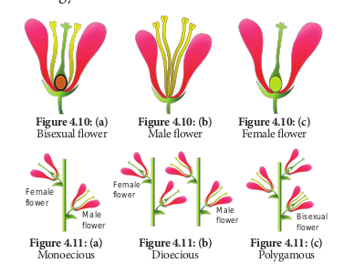
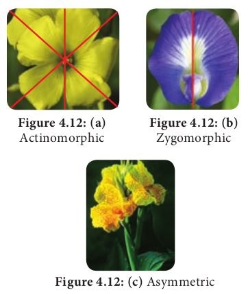

# Flower

In a plant, which part would you like the most? Of course, it is a flower, because of its colour and fragrance. The flower is a significant diagnostic feature of angiosperms. It is a modified condensed reproductive shoot. The growth of the flower shoot is determinate.

## Whorls of flower

There are two whorls, accessory and essential. Accessory whorl consists of calyx and corolla and essential whorl comprises of androecium and gynoecium.

Flower is said to be **Complete** when it contains all four whorls. An **Incomplete** flower is devoid of one or more whorls.

## Flower sex

Flower sex refers to the presence or absence of androecium and gynoecium within a flower.

**1. Perfect or bisexual: If a flower contains** both androecium and gynoecium it is called as a perfect flower.

**2. Imperfect or unisexual:** When the flower contains only one of the essential whorls is called Imperfect flower. It is of two types:

**i) Staminate flowers**: Flowers with androecium alone.

**ii) Pistillate flowers:** Flowers with gynoecium alone.

**Figure 4.11: (b)** Dioecious

## Plant sex

Plant sex refers to the presence and distribution of flowers with different sexes in an individual plant.

**1. Hermaphroditic:** All the flowers of the plant are bisexual.

**2. Monoecious**: Both male and female flowers are present in the same plant Example: Coconut.

**3. Dioecious:** Male and Female flowers are present on separate plants. Example: Papaya, Palmyra.

**4. Polygamous:** The condition in which bisexual and unisexual (staminate/pistillate) flowers occur in a same plant is called **polygamous**. Example: _Musa_, _Mangifera_.

## Flower symmetry

What is the radius of a circle? Cut a paper into round shape, fold it so as to get two equal halves. In how many planes will you get equal halves? In how many planes you can divide a cucumber in two equal halves? A flower is symmetrical when it is divided into equal halves in any plane running through the center. Flower symmetry is an important structural adaptation related to pollination systems.

**1. Actinomorphic (or) radial or polysymmetric: The flower shows two** mirror images when cut in any plane or radius through the centre.Normally there are more than two planes of symmetry. Example: _Hibiscus, Datura_.

**2. Zygomorphic (bilateral symmetry**) or monosymmetric: The flower can be divided into 2 equal halves in only one plane. Zygomorphic flower can efficiently transfer pollen grains to visiting pollinators. Example: _Pisum_, Bean.

**3. Asymmetric (amorphic**): Flower lacks any plane of symmetry and cannot be divided into equal halves in any plane. Parts of such flowers are twisted. Example: _Canna indica_.
