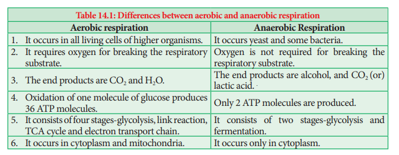
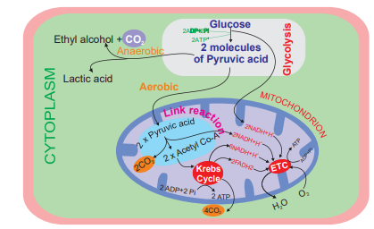
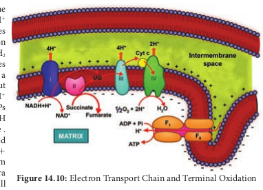
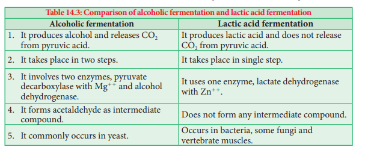
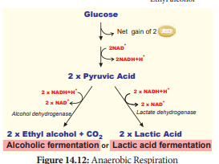
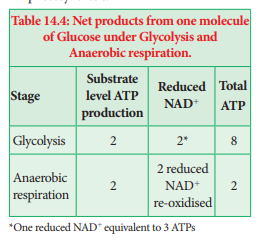

If you are sleeping under a tree during night time you will feel difficulty in breathing. During night, plants take up oxygen and release carbon dioxide and as a result carbon dioxide will be abundant around the tree. This process of CO2 evolution is called **respiration**. This process takes place during day time also (Figure 14.1). It is accompanied by breakdown of substrates and release of energy. In this chapter, respiration process in plants at cellular level will be dealt with.

# 14.1 Gaseous Exchange 

## 14.1.1 Respiration
The term respiration was coined by **Pepys** (1966). Respiration is a biological process in which oxidation of various food substances like carbohydrates, proteins and fats take place and as a result of this, energy is produced where O2 is taken in and CO2 is liberated. The organic substances which are oxidised during respiration are called respiratory substrates. Among these, glucose is the commonest respiratory substrate. Breaking of C-C bonds

     

of complex organic compounds through oxidation within the cells leads to energy release. The energy released during respiration is stored in the form of **ATP** (Adenosine Tri Phosphate) as well as liberated heat. Respiration occurs in all the living cells of organisms. The overall process of respiration corresponds to a reversal of photosynthesis.

`formulae`
`C6H12O6 1 6O2 → 6CO2 1 6H2O 1 Energy (686 K cal or 2868 KJ)`

`(1K cal = 4.184 KJ)`

Depending upon the nature of respiratory substrate, **Blackman** divided respiration into,

1. Floating respiration 
2. Protoplasmic respiration

When carbohydrate or fat or organic acid serves as respiratory substrate and it is called **floating respiration.** It is a common mode of respiration and does not produce any toxic product. Whereas respiration utilizing protein as a respiratory substrate, it is called **protoplasmic respiration**. Protoplasmic respiration is rare and it depletes structural and functional proteins of protoplasm and liberates toxic ammonia.  

### 14.1.2 Compensation point
At dawn and dusk the intensity of light is low. The point at which CO2 released in respiration is exactly compensated by CO2 fixed in photosynthesis that means no net gaseous exchange takes place, it is called **compensation point**. At this moment, the amount of oxygen released from photosynthesis is equal to the amount of oxygen utilized in respiration. The two common factors associated with compensation point are CO2 and light (Figure 14.2). Based on this there are two types of compensation point. They are CO2 compensation point and light compensation point. C3 plants have compensation points ranging from 40-60 ppm (parts per million) CO2 while those of C4 plants ranges from 1-5 ppm CO2.

# 14.2 Structure of ATP

Respiration is responsible for generation of ATP. The discovery of ATP was made by **Karl Lohman** (1929). ATP is a nucleotide consisting of a base-adenine, a pentose sugar-ribose and three phosphate groups. Out of three phosphate groups the last two are attached by high energy rich bonds (Figure 14.3). On hydrolysis, it releases energy (7.3 K cal or 30.6 KJ/ATP) and it is found in all living cells and hence it is called **universal energy currency of the cell**. ATP is an instant source of energy within the cell. The energy contained in ATP is used in synthesis carbohydrates, proteins and lipids. The energy transformation concept was established by **Lipman** (1941).

# 14.3 Redox Reactions

`formulae`
`NAD1 1 2e - 1 2H1 NADH 1 H1`

`FAD 1 2e- 1 2H1 FADH2`

When NAD1 (Nicotinamide Adenine Dinucleotide-oxidised form) and FAD (Flavin Adenine Dinucleotide) pick up electrons and one or two hydrogen ions (protons), they get reduced to NADH 1 H1 and FADH2 respectively. When they drop electrons and hydrogen off they go back to their original form. The reaction in which NAD1 and FAD gain (reduction) or lose (oxidation) electrons are called **redox reaction** (Oxidation reduction reaction). These reactions are important in cellular respiration.

# 14.4 Types of Respiration
 Respiration is classified into two types as aerobic and anaerobic respiration (Figure 14.4)

`table`

## 14.4.1 Aerobic respiration
Respiration occurring in the presence of oxygen is called **aerobic respiration**. During aerobic respiration, food materials like carbohydrates, fats and proteins are completely oxidised into CO2, H2O and energy is released. Aerobic respiration is a very complex process and is completed in four major steps:

1. Glycolysis 
2. Pyruvate oxidation (Link reaction) 
3. Krebs cycle (TCA cycle) 
4. Electron Transport Chain (Terminal oxidation). 

### 14.4.2 Anaerobic respiration
 In the absence of molecular oxygen glucose is incompletely degraded into either ethyl alcohol or lactic acid (Table 14.1). It includes two steps:

1. Glycolysis 2. Fermentation

# 14.5Stages of Respiration

1. Glycolysis-conversion of glucose into pyruvic acid in cytoplasm of cell. 
2. Link reaction-conversion of pyruvic acid into acetyl coenzyme-A in mitochondrial matrix.
3. Krebs cycle-conversion of acetyl coenzyme A into carbon dioxide and water in the mitochondrial matrix.
4. Electron transport chain to tranfer electrons remove hydrogen ions and tranfer electrons from the products of glycolysis, link reaction and Krebs cycle It takes place in mitochondrial inner membrane to release ATP with water molecule by terminal oxidation (Figure 14.5).

## 14.5.1 Glycolysis

(Gr: Glykos = 5 Glucose, Lysis =  Splitting) Glycolysis is a linear series of reactions in which 6-carbon glucose is split into two molecules of 3-carbon pyruvic acid. The enzymes which are required for glycolysis are present in the cytoplasm (Figure 14.6). The reactions of glycolysis were worked out in yeast cells by three scientists **Gustav Embden** (German), **Otto** **Meyerhoff** (German) and **J**

**Parnas** (Polish) and so it is also called as **EMP pathway**. It is the first and common stage for both aerobic and anaerobic respiration. It is divided into two phases. 
1. **Preparatory phase** or endergonic phase or hexose phase (steps 1-5). 
2. **Pay off phase** or oxidative phase or exergonic phase or triose phase (steps 6-10). 
**1. Preparatory phase** Glucose enters the glycolysis from sucrose which is the end product of photosynthesis. Glucose is phosphorylated into glucose-6- phosphate by the enzyme hexokinase, and subsequent reactions are carried out by different enzymes (Figure 14.6). At the end of this phase fructose-1, 6 - bisphosphate is cleaved into glyceraldehyde-3- phosphate and dihydroxy acetone phosphate by the enzyme aldolase. These two are isomers. Dihydroxy acetone phosphate is isomerised into glyceraldehyde-3- phosphate by the enzyme triose phosphate isomerase, now two molecules of glyceraldehyde 3 phosphate enter into pay off phase. During preparatory phase two ATP molecules are consumed in step-1 and step-3 (Figure 14.6).

`**Check your grasp!** How many ATP molecules are produced from one sucrose molecule?`

**2. Pay off phase** Two molecules of glyceraldehyde-3- phosphate oxidatively phosphorylated into two molecules of 1,3 - bisphospho glycerate. During this reaction 2NAD1 is reduced to 2NADH 1 H1 by glyceraldehyde- 3- phosphate dehydrogenase at step 6. Further reactions are carried out by different enzymes and at the end two molecules of pyruvate are produced. In this phase, 2ATPs are produced at step 7 and 2 ATPs at step10 (Figure 14.6). Direct transfer of phosphate moiety from substrate molecule to ADP and is converted into ATP is called **substrate phosphorylation**

or **direct phosphorylation** or **trans phosphorylation**. During the reaction at step 9, 2 phospho glycerate dehydrated into Phospho enol pyruvate. A water molecule is removed by the enzyme enolase. As a result, enol group is formed within the molecule. This process is called **Enolation. 
3. Energy Budget** In the pay off phase totally 4ATP and 2NADH 1 H1 molecules are produced. Since 2ATP molecules are already consumed in the preparatory phase, the net products in glycolysis are 2ATPs and 2NADH + H1+.

The overall net reaction of glycolysis 

`formulae`
`C6 H12O6 1 2ADP 1 2Pi 1 2NAD1`

`2x CH3COCOOH 1 2ATP 12NADH12H1`

### 14.5.2  Pyruvate Oxidation (Link reaction)
Two molecules of pyruvate formed by glycolysis in the cytosol enters into the mitochondrial matrix. In aerobic respiration this pyruvate with coenzyme A is oxidatively decarboxylated into acetyl CoA by pyruvate dehydrogenase complex. This reaction is irreversible and produces two molecules of NADH 1 H1 and 2CO2. It is also called **transition reaction**

or **Link reaction**. The reaction of pyruvate oxidation is

`formulae`
`2x CH3COCOOH 1 2NAD1 1 2CoA`

`2xCH3CO.CoA1 2NADH12H11 2CO2↑`

Pyruvate dehydrogenase complex consist of three distinct enzymes, such as  
1. Pyruvate dehydrogenase 
2. Dihydrolipoyil transacetylase
3. Dihydrolipoyil dehydrogenase and five different coenzymes, TPP (Thymine Pyro Phosphate), NAD1, FAD, CoA and lipoate.

### 14.5.3 Krebs cycle or Citric acid cycle or TCA cycle:
Two molecules of acetyl CoA formed from link reaction now enter into Krebs cycle. It is named after its discoverer, German Biochemist **Sir Hans Adolf Krebs** (1937). The enzymes necessary for TCA cycle are found in mitochondrial matrix except succinate dehydrogenase enzyme which is found in mitochondrial inner membrane (Figure 14.7).

TCA cycle starts with condensation of acetyl CoA with oxaloacetate in the presence of water to yield citrate or citric acid. Therefore, it is also known as **Citric Acid Cycle (CAC)** or **Tri Carboxylic Acid (TCA) cycle**. It is followed by the action of different enzymes in cyclic manner. During the conversion of succinyl CoA to succinate by the enzyme succinyl CoA synthetase or succinate thiokinase, a molecule of ATP synthesis from substrate without entering the electron transport chain is called **substrate level phosphorylation.** In animals a molecule of GTP is synthesized from GDP1Pi. In a coupled reaction GTP is converted to GDP with simultaneous synthesis of ATP from ADP1Pi. In three steps (4, 6, 10) in this cycle NAD1 is reduced to NADH1 H1 and at step 8 (Figure14.8) where FAD is reduced to FADH2.

The summary of link reaction and Krebs cycle in Mitochondria is

`formulae`
`Pyruvic acid 1 4NAD1 1 FAD 1 4H2O 1 ADP1Pi`

`3CO21 4NADH14H1 1FADH2 1H2O1ATP.`

Two molecules of pyruvic acid formed at the end of glycolysis enter into the mitochondrial matrix. Therefore, Krebs cycle is repeated twice for every glucose molecule where two molecules of pyruvic acid produces six molecules of CO2, eight molecules of NADH 1 H1, two molecules of FADH2 and two molecules of ATP. 
**1. Significance of Krebs cycle:** 

1. TCA cycle is to provide energy in the form of ATP for metabolism in plants. 
2. It provides carbon skeleton or raw material for various anabolic processes. 
3. Many intermediates of TCA cycle are further metabolised to produce amino acids, proteins and nucleic acids.
4. Succinyl CoA is raw material for formation of chlorophylls, cytochrome, phytochrome and other pyrrole substances.
5. α-ketoglutarate and oxaloacetate undergo reductive amination and produce amino acids.
6. It acts as metabolic sink which plays a central role in intermediary metabolism. 

**2. Amphibolic nature** Krebs cycle is primarily a catabolic pathway, but it provides precursors for various biosynthetic pathways there by an anabolic pathway too. Hence, it is called **amphibolic pathway**. It serves as a pathway for oxidation of carbohydrates, fats and proteins. When fats are respiratory substrate they are first broken down into glycerol and fatty acid. Glycerol is converted into DHAP and acetyl CoA. This acetyl CoA enter into the Krebs cycle. When proteins are the respiratory substrate they are degraded into amino acids by proteases. The amino acids after deamination enter into the Krebs cycle through pyruvic acid or acetyl CoA and it depends upon the structure. So respiratory intermediates form the link between synthesis as well as breakdown. The citric acid cycle is the final common pathway for oxidation of fuel molecules like amino acids, fatty acids and carbohydrates. Therefore, respiratory pathway is an amphibolic pathway (Figure 14.9).

### 14.5.4 Electron Transport Chain (ETC) (Terminal oxidation)

During glycolysis, link reaction and Krebs cycle the respiratory substrates are oxidised

at several steps and as a result many reduced coenzymes NADH 1 H1 and FADH2 are produced. These reduced coenzymes are transported to inner membrane of mitochondria and are converted back to their oxidised forms produce electrons and protons. In mitochondria, the inner membrane is folded in the form of finger projections towards the matrix called cristae. In cristae many oxysomes (F1 particles) are present which have electron transport carriers. According to **Peter Mitchell’s Chemiosmotic theory** this electron transport is coupled to ATP synthesis. Electron and hydrogen(proton) transport takes place across four multiprotein complexes(I-IV). They are 
**1. Complex-I (NADH dehydrogenase).** 
It contains a flavoprotein(FMN) and associated with non-heme iron Sulphur protein (Fe-S). This complex is responsible for passing electrons and protons from mitochondrial NADH (**Internal)** to Ubiquinone (UQ).

`formulae``formulae`
`NADH 1 H1 1 UQ NAD1 1 UQH2`

**In plants**, an additional NADH dehydrogenase (**External)** complex is present on the outer surface of inner membrane of mitochondria which can oxidise cytosolic NADH 1 H1. Because mitochondrial inner membrane cannot allow NADH molecules directly into the matrix.

Ubiquinone (UQ) or Coenzyme Quinone (CoQ) is a small, lipid soluble electron, proton carrier located within the inner membrane of mitochondria. 
**2. Complex-II (Succinic dehydrogenase)** 
It contains FAD flavoprotein is associated with non-heme iron Sulphur (Fe-S) protein. This complex receives electrons and protons from succinate in Krebs cycle and is converted into fumarate and passes to ubiquinone.

`formulae`
`Succinate 1 UQ → Fumarate 1 UQH2`

**3.** **Complex-III (Cytochrome bc1 complex)** 
This complex oxidises reduced ubiquinone (ubiquinol) and transfers the electrons through Cytochrome bc1 Complex (Iron Sulphur center bc1 complex) to cytochrome c. Cytochrome c is a small protein attached to the outer surface of inner membrane and act as a mobile carrier to transfer electrons between complex III to complex IV.

`formulae`
`UQH212Cyt c oxidised`

`UQ12Cyt c reduced12H1`

**4. Complex IV (Cytochome c oxidase)** 
This complex contains two copper centers (A and B) and cytochromes a and a3. Complex IV is the terminal oxidase and brings about the reduction of 1/2 O2 to H2O. Two protons are needed to form a molecule of H2O (terminal oxidation).

`formulae`
`2Cyt coxidised 1 2H1 1 1/2 O2`

`2Cyt creduced 1H2O`

The transfer of electrons from reduced coenzyme NADH to oxygen _via_ complexes I to IV is coupled to the synthesis of ATP from ADP and inorganic phosphate (Pi) which is called **Oxidative phosphorylation**. The F0F1-ATP synthase (also called complex V) consists of F0 and F1. F1 converts ADP and Pi to ATP and is attached to the matrix side of the inner membrane. F0 is present in inner membrane and acts as a channel through which protons come into matrix.

  

Oxidation of one molecule of NADH 1 H1 gives rise to 3 molecules of ATP and oxidation of one molecule FADH2

produces 2 molecules of ATP within a mitochondrion. But cytoplasmic NADH 1 H1 yields only two ATPs through external NADH d e h y d r o g e n a s e . Therefore, two reduced coenzyme (NADH 1 H1) molecules from glycolysis being extra mitochondrial will yield 2 3 2 5 4 ATP molecules instead of 6 ATPs (Figure 14.10). The Mechanism of mitochondrial ATP synthesis is based on Chemiosmotic hypothesis. According to this theory electron carriers present in the inner mitochondrial membrane allow for the transfer of protons (H1). For the production of single ATP, 3 protons (H1) are needed. The terminal oxidation of external NADH bypasses the first phosphorylation site and hence only two ATP molecules are produced per external NADH oxidised through mitochondrial electron transport chain. However, in those animal tissues in which malate shuttle mechanism is present, the oxidation of external NADH will yield almost 3 ATP molecules.

Complete oxidation of a glucose molecule in aerobic respiration results in the net gain

`table`

of **36 ATP** **molecules in plants** as shown in table 14.2. Since huge amount of energy is generated in mitochondria in the form of ATP molecules they are called **‘power house of the cell’.** In the case of aerobic prokaryotes due to lack of mitochondria each molecule of glucose produces 38 ATP molecules.

**Recent view** 
When the cost of transport of ATPs from matrix into the cytosol is considered, the number will be ## ATPs for each NADH
 1 **H**1 **and 1.5 ATPs for each FADH2** oxidised during electron transport system.

Therefore, in plant cells net yield of 30 ATP molecules for complete aerobic oxidation of one molecule of glucose. But in those animal cells (showing malate shuttle mechanism) net yield will be 32 ATP molecules.

# 14.6 Respiratory Quotient (RQ)
 The ratio of volume of carbon dioxide given out and volume of oxygen taken in during respiration is called **Respiratory Quotient or Respiratory ratio**. RQ value depends upon respiratory substrates and their oxidation.

`formulae`
`RQ = Volume of CO2 liberated / Volume of O2 consumed` 

1. The respiratory substrate is a carbohydrate, it will be completely oxidised in aerobic respiration and the value of the RQ will be equal to unity. 

`formulae`
`C6H12O6 1 6O2 6CO2 ↑ 1 6H2O 1 Energy Glucose`

`RQ of glucose 5 6 molecules of CO2`
`6 molecules of O2 = 1 (unity)` 

2. If the respiratory substrate is a carbohydrate it will be incompletely oxidised when it goes through anaerobic respiration and the RQ value will be infinity. 

`formulae`
`C6H12O6 2CO2↑1 2C2H5OH 1 Energy Glucose Ethyl alcohol  }RQ of glucose 5 2 molecules of CO2 Anaerobically zero molecule of O2 5 ∞ (infinity)`

3. In some succulent plants like O_puntia, Bryophyllum_ carbohydrates are partially oxidised to organic acid, particularly malic acid without corresponding release of CO2 but O2 is consumed hence the RQ value will be zero. 

`formulae`
`2C6H12O6 1 3O2 3C4H6O5 1 3H2O 1 Energy Glucose Malic acid RQ of glucose 5 zero molecule of CO2 in succulents 3 molecules of O2 5 0 (zero)`

4. When respiratory substrate is protein or fat, then RQ will be less than unity. 

`formulae`
`2(C51H98O6) 1 145O2 102CO2↑1 98H2O 1 Energy Tripalmitin(Fat) RQ of 5 102 molecules of CO2 Tripalmitin 145 molecules of O2 5 0.7 (less than unity)` 

5. When respiratory substrate is an organic acid the value of RQ will be more than unity. 

`formulae`
`C4H6O5 1 3O2 4CO2 ↑1 3H2O 1 Energy Malic acid RQ of 5 4 molecules of CO2 malic acid 3 molecules of O2 5 1.33 (more than unity)` 

**Significance of RQ** 
1. RQ value indicates which type of respiration occurs in living cells, either aerobic or anaerobic.

2. It also helps to know which type of respiratory substrate is involved.

# 14.7 Anaerobic Respiration 

## 14.7.1 Fermentation
Some organisms can respire in the absence of oxygen. This process is called **fermentation or anaerobic**

`table`

**respiration** (Figure 14.12). There are three types of fermentation: 
1. Alcoholic fermentation 
2. Lactic acid fermentation 
3. Mixed acid fermentation

**1. Alcoholic fermentation** The cells of roots in water logged soil respire by alcoholic fermentation because of lack of oxygen by converting pyruvic acid into ethyl alcohol and CO2. Many species of yeast (Saccharomyces) also respire anaerobically. This process takes place in two steps:

`formulae`
`(i) 2CH3COCOOH Pyruvate decarboxylase TPP 2CH3CHO 1 2CO2↑ Pyruvic acid Acetaldehyde`
`(ii) 2CH3CHO 1 2NADH12H1 Alcohol dehydrogenase Acetaldehyde 2CH3CH2OH 1 2NAD1 Ethyl alcohol`

**Industrial uses of alcoholic fermentation:** 
1. In bakeries, it is used for preparing bread, cakes, biscuits. 

2. In beverage industries for preparing wine and alcoholic drinks. 

3. In producing vinegar and in tanning, curing of leather. 

4. Ethanol is used to make gasohol (a fuel that is used for cars in Brazil). 

**2. Lactic acid fermentation** Some bacteria (_Bacillus_), fungi and muscles of vertebrates produce lactic acid from pyruvic acid (Table 14.3).

`formulae`
`2CH3COCOOH 1 2NADH12H1 Pyruvic acid  2CH3CHOHCOOH 1 2NAD1 Lactic acid`

**3. Mixed acid fermentation** This type of fermentation is a characteristic feature of Enterobacteriaceae and results in the formation of lactic acid, ethanol, formic acid and gases like CO2 and H2.

**Characteristics of Anaerobic Respiration** 
1. Anaerobic respiration is less efficient than the aerobic respiration (Figure 14.12). 

2. Limited number of ATP molecules is generated per glucose molecule (Table 14.4). 

3. It is characterized by the production of CO2 and it is used for Carbon fixation in photosynthesis.

`table`

# 14.8  Factors Affecting Respiration

# 14.9 Pentose Phosphate Pathway (Phospho Gluconate Pathway)

During respiration breakdown of glucose in cytosol occurs both by glycolysis (about 2/3) as well as by oxidative pentose phosphate pathway (about 1/3). Pentose phosphate pathway was described by **Warburg**, **Dickens** and **Lipmann**  (1938). Hence, it is also called **Warburg-Dickens-Lipmann** pathway. It takes place in cytoplasm of mature plant cells. It is an alternate way for breakdown of glucose (Figure 14.15).

It is also known as **Hexose monophosphate shunt (HMP Shunt) or Direct Oxidative Pathway**. It consists of two phases, oxidative phase and non-oxidative phase. The oxidative events convert six molecules of six carbon Glucose-6-phosphate to 6 molecules of five carbon sugar Ribulose-5 phosphate with loss of 6CO2 molecules and generation of 12  NADPH 1 H1 (not  NADH). The remaining reactions known as **non-oxidative pathway**, convert Ribulose-5-phosphate molecules to various intermediates such as Ribose-5-phosphate(5C), Xylulose5-phosphate(5C), Glyceraldehyde-3- phosphate(3C), Sedoheptulose-7-Phosphate (7C), and Erythrose-4-phosphate (4C). Finally, five molecules of glucose-6- phosphate is regene-rated (Figure 14.16). The overall reaction is:  

`formulae`
`6 x Glucose-6-Phosphate 1 12NADP1 1 6H2O`

`5 x Glucose-6-Phosphate 1 6CO2 1 Pi 1 12NADPH 112H1`

The net result of complete oxidation of one glucose-6-phosphate yield 6CO2 and 12NADPH 1 H1. The oxidative pentose 

phosphate pathway is controlled by glucose- 6-phosphate dehydrogenase enzyme which is inhibited by high ratio of NADPH to NADP1.

Significance of pentose phosphate pathway 

1. HMP shunt is associated with the generation of two important products, NADPH and pentose sugars, which play a vital role in anabolic reactions.

2. Coenzyme NADPH generated is used for reductive biosynthesis and counter damaging the effects of oxygen free radicals

3. Ribose-5-phosphate and its derivatives are used in the synthesis of DNA, RNA, ATP, NAD1, FAD and Coenzyme A.

4. Erythrose is used for synthesis of anthocyanin, lignin and other aromatic compounds.

5. It plays a role on fixation of Co2 in photosynthesis through RUBP.

