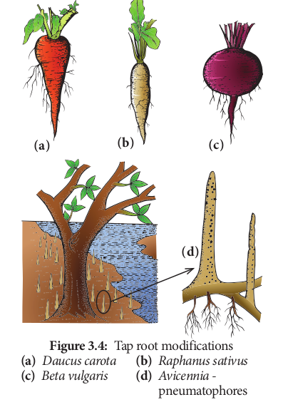
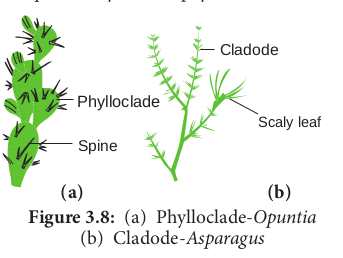
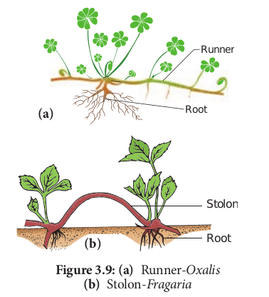
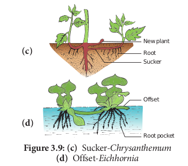
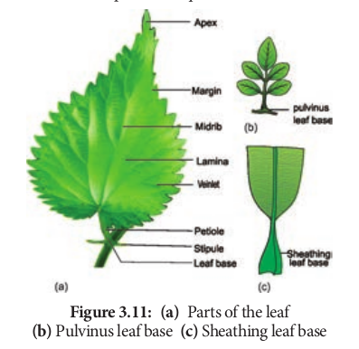
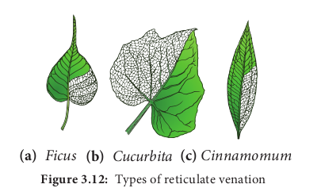
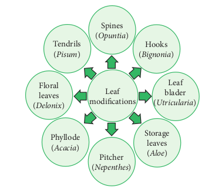

**Learning Objectives**
The learner will be able to,
- Explore the parts of the flowering plant. 
- Differentiate vegetative morphology and reproductive morpholog. 
- Compare various Root systems and their modification. 
- Understand the stem modifications and function. 
- Interpret the structure and functions of leaf

**Chapter Outline** 
**3.1** Habit 
**3.2** Plant habitat 
**3.3** Life Span 
**3.4** Parts of a flowering plant 
**3.5** Root System 
**3.6** Shoot system 
**3.7** Leaf 

The study of various external features of the organism is known as **Morphology.** **Plant Morphology** is also known as **external morphology that** deals with the study of shape, size and structure of plants and their parts (roots, stems, leaves, flowers, fruits and seeds). Study of Morphology is important in Taxonomy. Morphological features are important in determining productivity of crops. Morphological characters indicate the specific habitats of living as well as the fossil plants and help to correlate the distribution in space and time of fossil plants. Morphological features are also significant for phylogeny. **Plant Morphology can be studied under two broad categories:**

A. **Vegetative Morphology –** It includes shoot system and root system

B. **Reproductive Morphology –** It includes Flower/Inflorescence, Fruit and Seed

**A. Vegetative morphology** 

**Vegetative morphology** deals with the study of shape, size and structure of plants and their parts like roots, stems and leaves. To understand the vegetative morphology the following important components are to be studied. They are, 1) Habit, 2) Habitat and 3) Lifespan. 

## Habit

The general form of a plant is referred as habit. Based on habit, plants are classified into herbs, shrubs, climbers (vines) and trees. 

**I. Herbs** 

Herbs are soft stemmed plants with less wood or no wood. Example: _Phyllanthus amarus, Cleome viscosa._ According to the duration of their life they may be classified as **annuals**, **biennials** and **perennials**. Perennial herbs having a bulb, corm, rhizome or tuber as the underground stem are termed as **geophytes.** Example: _Allium cepa_ 

**II. Shrubs** 

A shrub is a perennial, woody plant with several main stems arising from the ground level. Example: _Hibiscus rosa sinensis (_shoe flower_)_

**III. Climbers (Vine)** 

An elongated weak stem generally supported by means of climbing devices are called **Climbers** (vines) which may be annual or perennial, herbaceous or woody. **Liana** is a vine that is perennial and woody. Liana’s are major components in the tree canopy layer of some tropical forests. Example: _Ventilago, Entada_, _Bougainvillea._ 

**IV. Trees** 

A tree is a stout, tall, perennial, woody plant having one main stem called **trunk** with many lateral branches. Example: Mango, Sapota, Jack, Fig, Teak. If the trunk remains unbranched it is said to be **caudex.** Example: Palmyra, Coconut. 

## Plant habitat

Depending upon where plants grow habitats may be classified into two major categories: I. Terrestrial and II.Aquatic. 

**I. Terrestrial** 

Plants growing on land are called **terrestrial plants.** 

**II. Aquatic** 

Plants that are living in water are called **aquatic plants** or hydrophytes. 

## Life Span

Based on life span plants are classified into 3 types. They are annuals, biennials and perennials 

**I. Annuals** 

A plant that completes its life cycle in one growing season. Example: Maize, Water melon, Groundnut, Rice. 

**II. Biennials** 

A plant that lives for two seasons, growing vegetatively during the first season and flowering and fruiting during the second season. Example: Carrot, Radish, Cabbage. 

**III. Perennials** 

A plant that grows for many years that flowers and set fruits for several seasons during the life span. When they bear fruits every year, they are called **polycarpic perennials.** Example: Mango, Sapota. Some plants produce flowers and fruits only once and die after a vegetative growth of several years. These plants are called **monocarpic perennials**. Example: _Bambusa_, _Agave, Musa._ 

## Parts of a flowering plant

Flowering plants are called **“Angiosperms”** or **Magnoliophytes**. They are sporophytes consisting of an axis with an underground **“Root system”** and an aerial **“Shoot System”.** The shoot system has a stem, branches and leaves. The root system consists of root and its lateral branches.

**Figure: 3.1:** Parts of a flowering plant

## Root System

The root is non-green, cylindrical descending axis of the plant that usually grows into the soil (positively geotropic). It develops from the radicle which is the first structure that comes out when a seed is placed in the soil. Root is responsible for absorption of water and nutrients and anchoring the plant. **I. Characteristic features**

- Root is the descending portion of the plant axis. 
- Generally non-green in colour as it lacks chlorophyll. 
- Does not possess nodes, internodes and buds (Exception in sweet potato and members of Rutaceae, roots bear buds which help in vegetative propagation)
- It bears root hairs (To absorb water and minerals from the soil)
- It is positively geotropic and negatively phototropic in nature.

**II. Regions of root** 

Root tip is covered by a dome shaped structure made of parenchymatous cells called **root cap.**

It protects the meristematic cells in the apex. In _Pandanus_ multiple root cap is present. In _Pistia_ instead of root cap, root pocket is present. A few millimeters above the root cap the following three distinct zones have been classified based on their meristematic activity. 
1. Meristematic Zone 
2. Zone of Elongation 
3. Zone of Maturation

### Types of root system

**I. Tap root system** 

Primary root is the direct prolongation of the radicle. When the primary root persists and continues to grow as in dicotyledons, it forms the main root of the plant and is called the **Tap root.** Tap root produces lateral roots that further branches into finer roots. Lateral roots along with the branches together called as **secondary roots**.

**II. Adventitious root system** 

Root developing from any part of the plant other than radicle is called **adventitious** root. It may develop from the base of the stem or nodes or internodes. Example: _Monstera deliciosa, Piper nigrum_. In most of the monocots the primary root of the seedling is short lived and lateral
**Table 3.1: Root zones**
|Feature|1. Meristematic Zone (Region of cell division )|2. Zone of Elongation|2. Zone of Maturation|
|---|---|---|---|
|Position|It lies just above the root caps|It lies just above the meristematic zone|It lies above the zone of elongation|
|Type Of Cells|Meristematic cells, actively divide and continuously increase in number|Elongated cells|Mature differentiated cells|
|Functions|This is the main growing tip of the root|The cells increase the length and cause enlargement of the root. |The cells differentiate into various tissues like epidermis, cortex and vascular bundles. It also produces root hairs which absorb water and minerals from the soil| 

roots arise from various regions of the plant body. These are bunch of thread-like roots nearly equal in size which are collectively called **fibrous** root system generally found in grasses. Example: _Oryza sativa, Eleusine coracana_. 

### Functions of root

Root performs two kinds of functions namely primary and secondary functions. 

**Primary function** 

1. Absorb water and minerals from soil. 
2. Help to anchor the plant firmly in the soil.

**Secondary function**

In some plants roots perform additional functions. These are called **secondary functions.** To perform additional functions, structure of roots are modified. 

### Modifications of root 
I. Tap root modification 

a. Storage roots 

**1. Conical Root**

These are cone like, broad at the base and gradually tapering towards the apex. Example: _Daucus carota_. 

**2. Fusiform Root** 

These roots are swollen in the middle and tapering towards both ends. Example: _Raphanus sativus_ 

**3. Napiform Root** 

It is very broad at the apex and suddenly tapers like a tail at the base. Example: _Beta vulgaris_

**b. Breathing root** 

Some mangrove plants like **_Avicennia, Rhizophora, Bruguiera_** develop special kinds of roots (Negatively geotropic) for respiration because the soil becomes saturated with water and aeration is very poor. They have a number of breathing pores on pneumatophores for exchange of gases.

**II. Adventitious root modification** 

**a. Storage roots**

**1. Tuberous root** 
These roots are swollen without any definite shape. Tuberous roots are produced singly and not in clusters. Example: _Ipomoea batatas._ 
**2. Fasciculated root** 
These roots are in cluster from the base of the stem Example: _Dahlia, Asparagus._ 
**3. Nodulose root** 
In this type of roots, swelling occurs only near the tips. Example: _Maranta_ (Arrow root) _Curcuma amada_ (Mango ginger), _Curcuma longa_ (Turmeric) 
**4. Moniliform or Beaded root** 
These roots swell at frequent intervals giving them a beaded appearance. Example: _Vitis, Portulaca, Momordica._ 
**5. Annulated root** 
These roots have a series of ring- like swelling on their surface at regular intervals. Example: _Psychotria_ (Ipecac) 

**b. Mechanical support** 

**1. Prop (Pillar) root** 
These roots grow vertically downward from the lateral branches into the soil. Example: _Ficus benghalensis_ (banyan tree), Indian rubber. 
**2. Stilt (Brace) root** 
These are thick roots growing obliquely from the basal nodes of the main stem. These provide mechanical support. Example: _Saccharum officinarum, Zea mays, Pandanus and Rhizophora_. 
**3. Climbing (clinging) roots** 
These roots are produced from the nodes of the stem which attach themselves to the support and help in climbing. To ensure a foothold on the support they secrete a sticky juice which dries up in air, attaching the roots to the support. Example: _Piper betel_. 
**4. Buttress root** 
In certain trees broad plank like outgrowths develop towards the base all around the trunk. They grow obliquely downwards and give support to huge trunks of trees. This is an adaptation for tall rain forest trees. Example: _Bombax ceiba_ (Red silk cotton tree), _Ceiba pentandra_ (white silk cotton tree), _Delonix regia, Bombax._

**c. Vital functions** 

**1. Epiphytic or velamen root** 

Some epiphytic orchids develop a special kind of aerial roots which hang freely in the air. These roots develop a spongy tissue called **velamen** which helps in absorption of moisture from the surrounding air. Example: _Vanda, Dendrobium_. 

**2. Foliar root** 

Roots are produced from the veins or lamina of the leaf for the formation of new plant. Example: _Bryophyllum,_ _Begonia_. 

**3. Sucking or Haustorial roots** 
These roots are found in parasitic plants. Parasites develop adventitious roots from stem which penetrate into the tissue of host plant and suck nutrients.
Example: _Cuscuta_ (dodder), _Cassytha_, _Orobanche_ (broomrape), _Viscum_ (mistletoe), _Dendrophthoe_. 

**4. Photosynthetic or assimilatory roots** 
Roots of some climbing or epiphytic plants develop chlorophyll and turn green which help in photosynthesis. Example: _Tinospora_, _Trapa natans_ (water chestnut), _Taeniophyllum_. 

## Shoot system

The plumule of the embryo of a germinating seed grows into stem. The epicotyl elongates after embryo growth into the axis (the stem) that bears leaves from its tip, which contain the actively dividing cells of the shoot called **apical meristem.** Further cell divisions and growth result in the formation of mass of tissue called **a leaf primordium.** The point from which the

leaf arises is called **node**. The region between two adjacent nodes is called **internode.**

**I. Characteristic features of the stem** 
1. The stem is aerial, green, photosynthetic and has nodes and internodes. 
2. It is positively phototropic and negatively geotropic. 
3. It has nodes and internodes. 
4. Stem bears vegetative bud for vegetative growth of the plant, and floral buds for reproduction, and ends in a terminal bud.
5. The young stem is green and thus carries out photosynthesis
6. During reproductive growth stem bears flowers and fruits.
7. Branches arise exogenously 
8. Some stems bears multicellular hairs of different kinds.

**II. Functions of the stem*** 
**Primary functions** 
1. It provides support and bears leaves,flowers and fruits. 
2. It transports water and mineral nutrients to other parts from the root. 
3. It transports food prepared by leaves to other parts of the plant body.

**Secondary functions** 
**1.Food storage**\- Example: _Solanum_
_tuberosum, Colocasia_ and _Zingiber officinale_ 
2. **Perennation / reproduction** – Example:_Zingiber officinale, Curcuma longa_ 
3. **Water storage** – Example: _Opuntia_ 
4. **Bouyancy** – Example: _Neptunia_ _Cuscuta Tinospora_ odification for Vital Functions Photosynthetic root
5. **Photosynthesis** – Example: _Opuntia, Ruscus, Euphorbia._
6. **Protection** – Example: _Citrus,_ _Bougainvillea, Acacia._
7. **Support** \- Example: _Passiflora,_ _Vitis, Cissus quadrangularis._

### Buds

Buds are the growing points surrounded by protective scale leaves. The bud primordium matures into bud. They have compressed axis in which the internodes are not elongated and the young leaves are closed and crowded. When these buds develop, the internodes elongate and the leaves spread out. Buds have architecture identical to the original shoot and develop into lateral branches or may terminate by developing into a flower or inflorescence. Based on origin, buds are classified into (a) Terminal or Apical bud (b) Lateral or Axillary or Axil bud. Based on function buds are classified into (a) Vegetative bud (b) Floral or Reproductive bud. 

1.**Terminal bud or apical bud:** These buds are present at the apex of the main stem and at the tips of the branches.

2.**Lateral bud or Axillary bud:** These buds occur in the axil of the leaves and develop into a branch or flower.

3.**Extra axillary bud :** These buds are formed at nodes but outside the axil of the leaf as in _Solanum_ _americanum._

**4. Accessory Bud:** An extra bud on either side (collateral bud) or above (superposed bud or serial bud) the axillary bud. Example: _Citrus_ and _Duranta_.

5.**Adventitious buds:** Buds arising at any part other than stem are known as **adventitious buds.** **Radical buds** are those that arises from the lateral roots which grow into plantlets. Example: _Millingtonia, Bergera koenigii (Murraya koenigii), Coffea arabica and Aegle marmelos._ **Foliar buds** are those that grow on leaves from veins or from margins of the leaves. Example: _Begonia_ (Elephant ear plant) and _Bryophyllum_ (Sprout leaf plant). **Cauline buds** arise directly from the stem either from cut, pruned ends or from branches. Adventitious buds function as propagules which are produced on the stem as tuberous structures. Example: _Dioscorea, Agave_.

6.**Bulbils** (**or specialized buds) :** Bulbils are modified and enlarged bud, meant for propagation. When bulbils detach from parent plant and fall on the ground, they germinate into new plants and serve as a means of vegetative propagation_. Example Agave_ an_d Allium proliferum_.

### Types of Stem

Majority of angiosperm possess upright, vertically growing erect stem. They may be many types they are (i) Excurrent, (ii) Decurrent, (iii) Caudex and (iv) Culm. 

**i. Excurrent** 

The main axis shows continuous growth and the lateral branches gradually becoming shorter towards the apex which gives a conical appearance to the trees. Example: _Monoon longifolium**(**Polyalthia longifolia), Casuarina._ 

**ii. Decurrent** 

The growth of lateral branch is more vigorous than that of main axis. The tree has a rounded or spreading appearance. Example: _Mangifera indica._ 

**iii. Caudex** 

It is an unbranched, stout, cylindrical stem, marked with scars of fallen leaves. Example: _Cocos nucifera._ 

**iv. Culm** 

Erect stems with distinct nodes and usually hollow internodes clasped by leaf sheaths. Example: Majority of grasses including Bamboo. 

### Modification of Stem 

I. Aerial modification of stem 

**1. Creepers**

These are plants growing closer (horizontally) to the ground and produce roots at each node. Example: _Cynodon dactylon, Centella._

**2. Trailers (Stragglers)** 

It is a weak stem that spreads over the surface of the ground without rooting at nodes. They are divided into 3 types,

i. **Prostrate (Procumbent):** A stem that grows flat on the ground. Example: _Indigofera prostrata._

ii. **Decumbent:** A stem that grows flat but becomes erect during reproductive stage. Example: _Tridax._

iii. **Diffuse:** A trailing stem with spreading branches. Example: _Boerhavia diffusa._

**3. Climbers** 

These plants have long weak stem and produce special organs for attachment for climbing over a support. Climbing helps to display the leaves towards sunlight and to position the flower for effective pollination. 

**i. Root climbers** 

Plants climbing with the help of adventitious roots (arising from nodes) as in species of _Piper betel, Piper nigrum, Pothos._ 

**ii. Stem climbers (Twiners)** 

These climbers lack specialised structure for climbing and the stem itself coils around the support. Example: _Ipomoea, Clitoria, Quisqualis._

Stem climbers may coil around the support either clockwise or anti-clockwise. Clockwise coiling climbers are called **dextrose.** Example: _Dioscorea alata_. Anti-clockwise coiling climbers are called **sinistrose.** Example: _Dioscorea bulbifera_.

**iii. Hook climbers** 

These plants produce specialized hook like structures which are the modification of various organs of the plant. In _Artabotrys_ inflorescence axis is modified into hook. In _Calamus_ (curved hook) leaf tip is modified into hook. In _Bignonia unguis-cati_ the leaflets are modified into curved hook (figure: 3.17). In _Hugonia_ the axillary buds modified into hook. 

**iv. Thorn climbers** 

Climbing or reclining on the support with the help of thorns as in _Bougainvillea_ and _Carissa._  

**v. Lianas (woody stem climber)**

Woody perennial climbers found in tropical forests are lianas. They twine themselves around tall trees to get light. Example_: Hiptage benghalensis,_ _Bauhinia_ _vahlii._

**vi. Tendril climbers** 

Tendrils are thread-like coiling structures which help the plants in climbing. Tendrils may be modifications of Stem – as in _Vitis_ and _Cissus quadrangularis;_ Inflorescence axis – _Antigonon;_ Leaf – _Lathyrus;_ Leaflets - _Pisum sativum;_ Petiole _– Clematis;_ Leaftip – _Gloriosa;_ Stipules – _Smilax_. In pitcher plant (_Nepenthes_) the midrib of the leaf often coils around a support like a tendril and holds the pitcher in a vertical position. 

**4. Phylloclade** This is a green, flattened cylindrical or angled stem or branch of unlimited growth, consisting of a series of nodes and internodes at long or short intervals. Phylloclade is characteristic adaptation of xerophytes where the leaves often fall off early and modified into spines or scales to reduce transpiration. The phylloclade takes over all the functions of leaves, particularly photosynthesis. The phylloclade is also called as **cladophyll.** Example: _Opuntia, Phyllocactus, Muehlenbeckia_ (flattened phylloclade) _Casuarina, Euphorbia tirucalli, Euphorbia antiquorum_ (cylindrical phylloclade)_.

**5. Cladode** Cladode is a flattened or cylindrical stem similar to Phylloclade but with one or two internodes only. Their stem nature is evident by the fact that they bear buds, scales and flowers. Example: _Asparagus_ (cylindrical cladode)_, Ruscus_ (flattened cladode)_._ 

**6. Thorns** Thorn is a woody and sharp pointed modified stem. Either the axillary bud or the terminal bud gets modified into thorns. In _Citrus_ and _Atalantia_ axillary bud is modified into thorns. 

**II.** **Sub aerial stem modifications** 

Sub aerial stem found in plants with weak stem in which branches lie horizontally on the ground. These are meant for vegetative propagation. They may be sub aerial or partially sub terranean. 
**1. Runner** 
This is a slender, prostrate branch creeping on the ground and rooting at the nodes. Example: _Oxalis_ (Wood sorrel), lawn grass (_Cynodon dactylon_). 

**2. Stolon** 
This is also a slender, lateral branch originating from the base of the stem. But it first grows obliquely above the ground, produces a loop and bends down towards the ground. When touches the ground it produces roots and becomes an independent plantlet. Example: _Mentha piperita_ (peppermint), _Fragaria indica_ (wild strawberry).

**3. Sucker** Sucker develops from an underground stem and grows obliquely upwards and gives rise to a separate plantlet or new plant. Example: _Chrysanthemum,_ _Bambusa_.

**4. Offset** Offset is similar to runner but found in aquatic plants especially in rosette leaved forms. A short thick lateral branch arises from the lower axil and grows horizontally leafless for a short distance, then it produces a bunch of rosette leaves and root at nodes. Example: _Eichhornia_ (water hyacinth), _Pistia_ (water lettuce).

**III. Underground stem modifications** 

Perennial and some biennial herbs have underground stems, which are generally known as **root stocks**. Rootstock functions as a storage and protective organ. It remains alive below the ground during unfavourable conditions and resumes growth during the favourable conditions.

Underground stems are not roots because they possess nodes, internodes, scale-leaves and buds. Rootstock also lack root cap and root hairs but they possess terminal bud which is a characteristics of stem.

**1. Bulb** It is a condensed conical or convex stem surrounded by fleshy scale leaves. They are of two types 1. Tunicated (coated) bulb: In which the stem is much condensed and surrounded by several concentric layers of scale leaves. The inner scales commonly fleshy, the outer ones dry. They can be classified into two types (a) Simple Tunicated bulb Example: _Allium cepa_ (b) Compound Tunicated bulb. Example: _Allium sativum_. 
**2. Corm** This is a succulent underground stem with an erect growing tip. The corm is surrounded by scale leaves and exhibit nodes and internodes. Example: _Amorphophallus, Colocasia, Colchicum_

](3.11.png)

**3. Rhizome** This is an underground stem growing horizontally with several lateral growing tips. Rhizome posses conspicuous nodes and internodes covered by scale leaves. Example: _Zingiber officinale, Canna, Curcuma longa, Musa._ 
**4. Tuber** This is a succulent underground spherical or globose stem with many embedded axillary buds called **“eyes”.** Example: _Solanum tuberosum, Helianthus tuberosus._ 

**IV. Stem Branching** 

Branching pattern is determined by the relative activity of apical meristems. The mode of arrangement of branches on a stem is known as **branching.** There are two main types of branching, 1. Lateral branching and 2. Dichotomous branching. Based on growth pattern stems may show indeterminate or determinate growth.

**1.Indeterminate:** The terminal bud grows uninterrupted and produce several lateral branches. This type of growth is also known as **monopodial branching.** Example: _Polyalthia, Swietenia_.

**2.Determinate:** The terminal bud caese to grow after a period of growth and the further growth is taken care by successive or several lateral meristem or buds. This type of growth is also known as **sympodial branching.** Example: _Cycas_.

## Leaf

Leaves are green, thin flattened lateral outgrowths of the stem. Leaves are the primary photosynthetic organs and the main site of transpiration. All the leaves of a plant together are referred to as **phyllome**. 

**I. Characteristics of leaf** 
1. Leaf is a lateral appendage of the stem. 
2. It is borne at the node of the stem. 
3. It is exogenous in origin. 
4. It has limited growth. 
5. It does not posses apical bud. 
6. It has three main parts namely, leaf base,petiole and lamina. 
7. Lamina of the leaf is traversed by vascular strands, called **veins.** 

**II. Functions of the leaf** 
**Primary functions** 
1. Photosynthesis 
2. Transpiration 
3. Gaseous exchange 
4. Protection of buds 
5. Conduction of water and dissolved solutes. 

**Secondary functions** 
1. Storage – Example: _Aloe, Agave_. 
2. Protection – Example: _Opuntia, Argemone_ _mexicana_. 
3. Support – Example: _Gloriosa, Nepenthes._ 
4. Reproduction - Example:_Bryophyllum,_ _Begonia, Zamia._ 

### Parts of the leaf

Three main parts of a typical leaf are:  

i. Leaf base (Hypopodium) 
ii. Petiole (Mesopodium) 
iii. Lamina (Epipodium)

**I. Leaf base (hypopodium)** 

The part of the leaf attached to the node of the stem is called **leaf base.** Usually it protects the growing buds at its axil. **Pulvinus:** In legumes leaf base become broad and swollen which is known as **pulvinus.** Example: _Clitoria, Lablab, Cassia, Butea_. **Sheathing leafbase: In many monocot families** such as Arecaceae, Musaceae, Zingiberaceae and Poaceae the leafbase extends into a sheath and clasps part or whole of the internode. Such leafbase also leave permanent scars on the stem when they fall. 

**II. Petiole (stipe or mesopodium)** It is the bridge between lamina and stem. Petiole or leaf stalk is a cylindrical or sub cylindrical or flattened structure of a leaf which joins the lamina with the stem. A leaf with petiole are said to be **petiolate.** Example: _Ficus, Hibiscus._ Leaves that do not possess petiole is said to be **sessile**. Example_: Calotropis._

**Figure 3.11: (a)** Parts of the leaf **(b)** Pulvinus leaf base **(c)** Sheathing leaf base

**III. Lamina (Leaf blade)** The expanded flat green portion of the leaf is the blade or lamina. It is the seat of photosynthesis,gaseous exchange, transpiration and most of the metabolic reactions of the plant. The lamina is traversed by the midrib from which arise numerous lateral veins and thin veinlets. The lamina shows great variations in its shape, margin, surface, texture, colour, venation and incision. 

**Stipules** 

In most of the dicotyledonous plants, the leaf base bears one or two lateral appendages called the **stipules**. Leaves with stipules are called **stipulate**. The leaves without stipules are called **exstipulate or estipulate**. The stipules are commonly found in dicotyledons. In some grasses (Monocots) an additional out growth is present between leaf base and lamina. It is called **Ligule.** Sometimes, small stipule like outgrowths are found at the base of leaflets of a compound leaf. They are called **stipels.** The main function of the stipule is to protect the leaf in the bud condition. 

### Venation

The arrangement of veins and veinlets on the leaf blade or lamina is called **venation.** Internally, the vein contains vascular tissues. Conventionally venation is classified into two types namely, Reticulate venation and Parallel venation. 

**I. Reticulate venation** In this type of venation leaf contain a prominent midrib from which several secondary veins arise that branch and anastomose like a network. This type of venation is common in all dicot leaves. It is of two types. 

1. **Pinnately reticulate venation (unicostate):**

In this type of venation there is only one midrib in the centre which forms many lateral branches to form a network. Example: _Mangifera indica._

2. **Palmately reticulate venation (multicostate):** In this type of venation there are two or more principal veins arising from a single point and they proceed outwards or upwards. The two types of palmate reticulate venation are

i. **Divergent type:** When all principal veins originate from the base and diverge from one another towards the margin of the leaf as in _Carica papaya_.

ii. **Convergent:** When the veins converge to the apex of the leaf, as in Indian plum (_Zizyphus_), bay leaf (_Cinnamomum_).

**II. Parallel venation** Veins run parallel and do not form a prominent reticulum. It is a characteristic feature of monocot leaves. It is classified into two sub types.

**1. Pinnately Parallel Venation (Unicostate)** When there is a prominent midrib in the center, from which arise many veins perpendicularly and run parallel to each other. Example: _Musa_, Zinger. 

**2. Palmate Parallel Venation (Multicostate)** In this type several veins arise from the tip of the petiole and they all run parallel to each other and unite at the apex. It is of two sub types.

**i.Divergent type:** All principal veins originate from the base and diverge towards the margin, the margin of the leaf as in fan palm (_Borassus flabelliformis_)

**ii.Convergent type:** All principal veins run parallel to each other from the base of the lamina and join at the apex as in Bamboos, rice, water hyacinth.

**(a)** Pinnately reticulate **(b)** Palmately reticulate (Divergent) **(c)** Palmately reticulate (Convergent)

### Phyllotaxy

The mode of arrangement of leaves on the stem is known as **phyllotaxy (Gk. Phyllon** \= **leaf ; taxis** \= **arrangement**)**.** Phyllotaxy is to avoid over crowding of leaves and expose the leaves maximum to the sunlight for photosynthesis. The four main types of phyllotaxy are (1) Alternate (2) Opposite (3) Ternate (4) Whorled.

**1. Alternate phyllotaxy** 

In this type there is only one leaf per node and the leaves on the successive nodes are arranged alternate to each other. Spiral arrangement of leaves show vertical rows are called **orthostichies**. They are of two types. 
a) **Alternate spiral:** In which the leaves are arranged alternatively in a spiral manner. Example: _Hibiscus, Ficus_. 
b) **Alternate distichous** or **Bifarious**: In which the leaves are organized alternatively in two rows on either side of the stem. Example: _Monoon longifolium_ (_Polyalthia longifolia_).

**2. Opposite phyllotaxy** In this type each node possess two leaves opposite to each other. They are organized in two different types.

i. **Opposite superposed:** The pair of leaves arranged in succession are in the same direction, that is two opposite leaves at a node lie exactly above those at the lower node. Example: _Psidium_ (Guava), _Quisqualis_ (Rangoon creeper).

ii. **Opposite decussate:** In this type of phyllotaxy one pair of leaves is placed at right angles to the next upper or lower pair of leaves. Example: _Calotropis_, _Ocimum_

**3. Ternate phyllotaxy** 

In this type there are three leaves attached at each node. Example: _Nerium_ 

**4. Whorled (verticillate) type of phyllotaxy** 

In this type more than three leaves are present in a whorl at each node forming a circle or whorl. Example: _Allamanda_. 

### Leaf mosaic

In leaf mosaic leaves tend to fit in with one another and adjust themselves in such a way that they may secure the maximum amount of sunlight with minimum amount of overlapping. The lower leaves have longer petioles and successive upper leaves possess shorter petioles. Example: _Acalypha._ 

### Leaf type

The pattern of division of a leaf into discrete components or segments is termed leaf type. Based on the number of segments **I. Simple leaf** A leaf is said to be simple when the petiole bears a single lamina; lamina may be entire(undivided) Example: Mango or incised to any depth but not upto the midrib or petiole. Example: _Cucurbita_. 

**II. Compound leaf** Compound leaf is one in which the main rachis bears more than one lamina surface, called **leaflets.** Compound leaves have evolved to increase total lamina surface. There is one axillary bud in the axil of the whole compound leaf. The leaflets however, do not possess axillary buds. 
**1. Pinnately compound leaf** A pinnately compound leaf is defined as one in which the rachis, bears laterally a number of leaflets, arranged alternately or in an opposite manner, as in Tamarindus, _Cassia._

i. **Unipinnate:** The rachis is simple and unbranched which bears leaflets directly on its sides in alternate or opposite manner. Example: _Rose_, _Neem_. Unipinnate leaves are of two types.

a. when the leaflets are even in number, the leaf is said to be **paripinnate**. Example: _Tamarindus_.

b. when the leaflets are odd in number, the leaf is said to be **imparipinnate.** Example: _Azadirachta_ (Neem).

ii. **Bipinnate:** The primary rachis produces secondary rachii which bear the leaflets. The secondary rachii are known as **pinnae.** Number of pinnae varies depending on the species. Example: _Delonix_.

iii. **Tripinnate:** When the rachis branches thrice the leaf is called **tripinnate.** (i.e) the secondary rachii produce the tertiary rachii which bear the leaflets. Example: _Moringa_.

iv. **Decompound:** When the rachis of leaf is branched several times it is called **decompound.** Example: _Daucus carota, Coriandrum sativum._

**2. Palmately compound leaf** 

A palmately compound leaf is defined as one in which the petiole bears terminally, one or more leaflets which seem to be radiating from a common point like fingers from the palm.

i. **Unifoliolate:** When a single leaflet is articulated to the petiole is said to be unifoliolate. Example: _Citrus._

ii. **Bifoliolate:** When there are two leaflets articulated to the petiole it is said to be bifoliolate. Example: _Zornia diphylla_

iii. **Trifoliolate:** There are three leaflets articulated to the petiole it is said to be trifoliolate. Example: wood apple (_Aegle marmelos_), Clover (_Trifolium_).

iv. **Quadrifoliolate:** There are four leaflets articulated to the petiole it is said to be quadrifoliolate. Example: _Paris quadrifolia, Marsilia_

v. **Multifoliolate or digitate:** Five or more leaflets are joined and spread like fingers from the palm, as in _Cleome pentaphylla, Bombax ceiba_

### Modification of Leaf

The main function of the leaf is food preparation by photosynthesis. Leaves modified to perform some specialized functions. They are described below. 

**I. Leaf tendrils** 

In some plants stem is very weak and hence they have some special organs for attachment to the support. So some leaves are partially or wholly modified into tendril. Tendril is a slender wiry coiled structure which helps in climbing the support. Some of the modification of leaf tendrils are given below: Entire leaf—_Lathyrus,_ stipules—_Smilax,_ terminal leaflet—_Naravelia,_ Leaf tip— _Gloriosa_, Apical leaflet—_Pisum,_ petiole— _Clematis._ 

**II. Leaf hooks** 

In some plants, leaves are modified into hook-like structures and help the plant to climb. In cat,s nail (_Bignonia unguis-cati)_ an elegant climber, the terminal leaflets become modified into three, very sharp, stiff and curved hooks, very much like the nails of a cat. These hooks cling to the bark of a tree and act as organs of support for climbing. The leaf spines of _Asparagus_ also act as hooks.  

**III. Leaf Spines and Prickles** 

Leaves of certain plants develop spinesent structures. Either on the surface or on the margins as an adaptation to herbivory and xeric conditions. Example: _Zyzypus Argemone mexicana_ (Prickly poppy), _Solanum trilobatum_. In xerophytes such as _Opuntia_ (Prickly pear) and _Euphorbia_ leaves and stipules are modified into spines.

Prickles are small, sharp structure which are the outgrowths from epidermal cells of stem or leaf. It helps the plant in scrambling over other plants. It is also protective against herbivory. Example: _Rosa spp._

**IV. Storage Leaves** 

Some plants of saline and xerophytic habitats and members of the family Crassulaceae commonly have fleshy or swollen leaves. These succulent leaves store water, mucilage or food material. Such storage leaves resist desiccation. Example: _Aloe, Agave, Bryophyllum_.

**V. Phyllode** 

Phyllodes are flat, green-coloured leaf- like modifications of petioles or rachis. The leaflets or lamina of the leaf are highly reduced or caducous. The phyllodes perform photosynthesis and other functions of leaf. Example: _Acacia auriculiformis_ (Australian _Acacia_), _Parkinsonia._

**VI. Pitcher** 

The leaf becomes modified into a pitcher in _Nepenthes_ and _Sarracenia_. In _Nepenthes_ the basal part of the leaf is laminar and the midrib continues as a coiled tendrillar structure. The apical part of the leaf is modified into a pitcher the mouth of the pitcher is closed by a lid which is the modification of leaf apex.

**VII. Bladder** 

In bladderwort (_Utricularia_), a rootless free- floating or slightly submerged plant common in many water bodies, the leaf is very much segmented. Some of these segments are modified to form bladder-like structures, with a trap-door entrance that traps aquatic animalcules.

**VIII Floral leaves** 

Floral parts such as sepals, petals, stamens and carpels are modified leaves. Sepals and petals are leafy. They are protective in function and considered non-essential reproductive parts. Petals are usually coloured which attract the insects for pollination. Stamens are considered pollen bearing microsporophylls and carpels are ovule bearing megasporophylls.

### Leaf duration

Leaves may stay and function for few days to many years, largely determined by the adaptations to climatic conditions. 

**Caducuous (Fagacious)** 

Falling off soon after formation. Example: _Opuntia, Cissus quadrangularis._ Leaf hooks-_Bignonia_ Leaf spines- _Opuntia_ 

**Deciduous** 

Falling at the end of growing season so that the plant (tree or shrub) is leafless in winter/ summer season. Example: _Maple_, _Plumeria, Launea, Erythrina_. 

**Evergreen** 

Leaves persist throughout the year, falling regularly so that tree is never leafless. Example: _Mimusops, Calophyllum_. 

**Marcescent** 
Leaves not falling but withering on the plant as in several members of Fagaceae.
